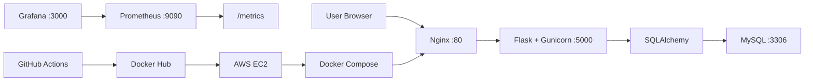
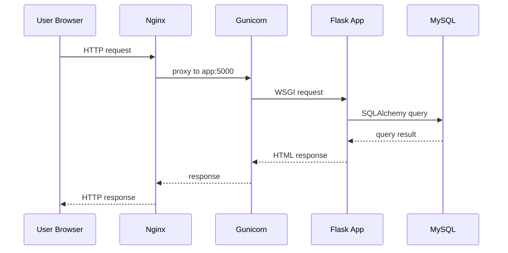
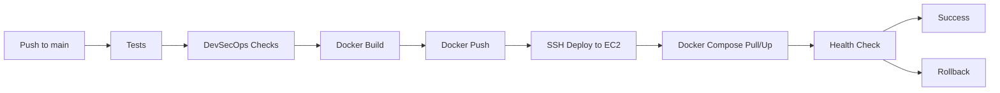
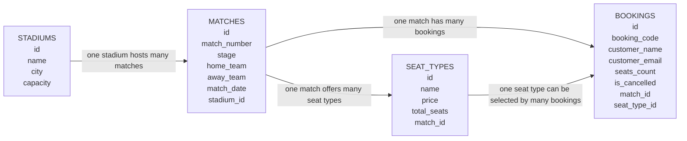
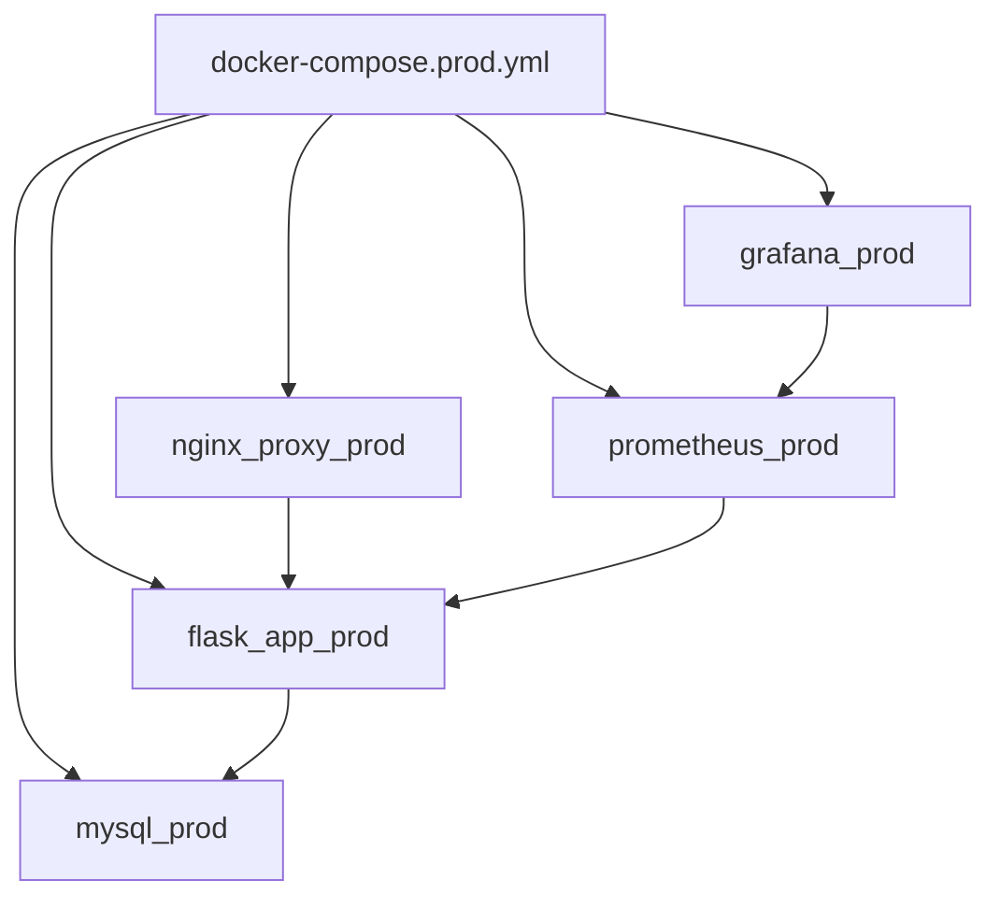
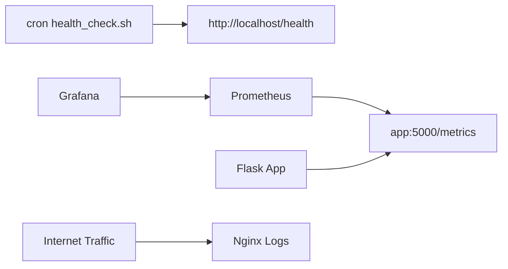
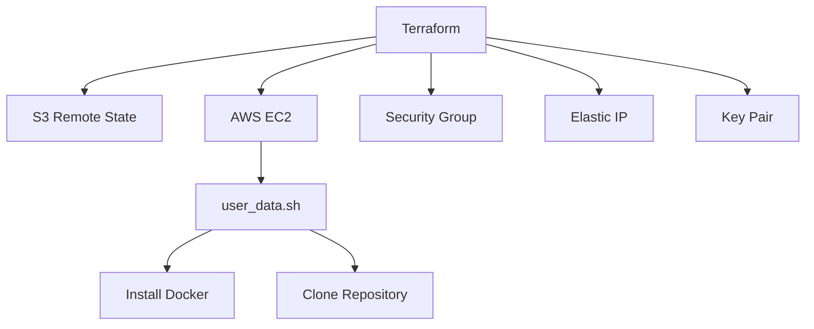

# ספר פרויקט גמר DevOps

| שדה | פרטים |
| --- | --- |
| שם הפרויקט | World Cup Seat Booking DevOps Project |
| שם הסטודנט | שלמה הורוויץ |
| תעודת זהות | ______________________________ |
| מכללה | ______________________________ |
| מסלול לימודים | DevOps |
| שם המנחה | ______________________________ |
| תאריך הגשה | ______________________________ |

---

## תוכן עניינים

1. [רקע DevOps](#פרק-1-רקע-devops)
2. [מטרת הפרויקט](#פרק-2-מטרת-הפרויקט)
3. [תיאור הפרויקט ודרישות הרצה](#פרק-3-תיאור-הפרויקט-ודרישות-הרצה)
4. [טכנולוגיות בשימוש](#פרק-4-טכנולוגיות-בשימוש)
5. [ארכיטקטורת המערכת ותהליך ה־CI/CD](#פרק-5-ארכיטקטורת-המערכת-ותהליך-ה-cicd)
6. [שכבת הכניסה וה־Frontend](#פרק-6-שכבת-הכניסה-וה-frontend)
7. [שכבת האפליקציה: Flask ו־Gunicorn](#פרק-7-שכבת-האפליקציה-flask-ו-gunicorn)
8. [שכבת הנתונים: MySQL ו־SQLAlchemy](#פרק-8-שכבת-הנתונים-mysql-ו-sqlalchemy)
9. [אריזת האפליקציה ב־Docker](#פרק-9-אריזת-האפליקציה-ב-docker)
10. [הרצת השירותים עם Docker Compose](#פרק-10-הרצת-השירותים-עם-docker-compose)
11. [תהליך GitHub Actions CI/CD](#פרק-11-תהליך-github-actions-cicd)
12. [Docker Hub ותגיות Images](#פרק-12-docker-hub-ותגיות-images)
13. [תשתית ענן: AWS EC2 ו־Security Groups](#פרק-13-תשתית-ענן-aws-ec2-ו-security-groups)
14. [Monitoring וניטור המערכת](#פרק-14-monitoring-וניטור-המערכת)
15. [משתני סביבה ו־Secrets](#פרק-15-משתני-סביבה-ו-secrets)
16. [DevSecOps](#פרק-16-devsecops)
17. [Testing](#פרק-17-testing)
18. [Terraform ותשתית כקוד](#פרק-18-terraform-ותשתית-כקוד)
19. [מבנה תיקיות הפרויקט](#פרק-19-מבנה-תיקיות-הפרויקט)
20. [בעיות מרכזיות ופתרונות](#פרק-20-בעיות-מרכזיות-ופתרונות)
21. [סיכום ושיפורים עתידיים](#פרק-21-סיכום-ושיפורים-עתידיים)
22. [נספחים](#פרק-22-נספחים)

---

## פרק 1: רקע DevOps

גישת DevOps מחברת בין פיתוח תוכנה לבין תפעול מערכות. המטרה היא לקצר את הדרך בין כתיבת הקוד לבין הרצת גרסה תקינה בסביבת שרת, תוך שמירה על תהליך מבוקר, חוזר ואמין.

בפרויקטים ללא תהליך DevOps מסודר, פעולות כמו התקנת תלויות, בניית גרסה, העתקת קבצים לשרת, הפעלת שירותים ובדיקת תקינות עלולות להתבצע ידנית. עבודה ידנית כזו גורמת לחוסר אחידות בין סביבות, מקשה על איתור תקלות ומגדילה את הסיכון לשגיאות.

בפרויקט זה עקרונות DevOps מיושמים באמצעות ניהול קוד ב־GitHub, בדיקות אוטומטיות, בניית Docker image, פרסום ל־Docker Hub, פריסה לשרת AWS EC2, ניטור המערכת, בדיקות אבטחה וניהול תשתית באמצעות Terraform.

---

## פרק 2: מטרת הפרויקט

מטרת הפרויקט היא להציג תהליך DevOps מלא סביב אפליקציית Web מבוססת Flask ו־MySQL. האפליקציה עצמה משמשת בסיס מעשי שמאפשר להדגים את כל שלבי מחזור החיים: פיתוח, בדיקה, אריזה, פרסום, פריסה, ניטור וניהול תשתית.

המערכת מדגימה כיצד שינוי קוד שנדחף ל־GitHub עובר בדיקות, נארז כ־Docker image, נשלח ל־Docker Hub, נמשך לשרת EC2 ומופעל מחדש באמצעות Docker Compose. לאחר הפריסה מתבצעת בדיקת health, ובמקרה של כשל קיימת יכולת rollback לגרסה הקודמת.

כך הפרויקט מדגיש לא רק בניית אפליקציה, אלא בעיקר בניית תהליך עבודה מקצועי, אוטומטי ומבוקר שמאפיין סביבת DevOps אמיתית.

---

## פרק 3: תיאור הפרויקט ודרישות הרצה

הפרויקט הוא מערכת Web להזמנת מקומות למשחקי World Cup 2026. המשתמש נכנס לאתר, צופה ברשימת משחקים, בוחר משחק, בוחר סוג מושב וכמות, ומבצע הזמנה. לאחר ההזמנה מתקבל קוד הזמנה ייחודי שמאפשר לחזור לפרטי ההזמנה ולבטל אותה במקרה הצורך.

למערכת יש גם אזור ניהול בסיסי. מנהל יכול להתחבר ולצפות בהזמנות ובסטטיסטיקות של משחקים, כמו כמות מושבים שהוזמנו וכמות מושבים זמינים.

מסלול העבודה המרכזי של הפרויקט:

```text
User -> Nginx -> Flask/Gunicorn -> SQLAlchemy -> MySQL
Developer -> GitHub Actions -> Docker Hub -> AWS EC2 -> Docker Compose
Prometheus -> /metrics -> Grafana
```

### דרישות להרצה מקומית

כדי להריץ את הפרויקט בסביבה מקומית נדרשים:

- Git.
- Docker Desktop או Docker Engine.
- Docker Compose plugin.
- קובץ `.env` שמבוסס על `.env.example`.
- גישה לטרמינל להרצת פקודות Docker.

פקודת הרצה מקומית:

```bash
docker compose up --build
```

לאחר ההרצה ניתן לגשת לאפליקציה דרך:

```text
http://localhost:5001
```

בדיקת זמינות מקומית:

```bash
curl http://localhost:5001/health
```

---

## פרק 4: טכנולוגיות בשימוש

### Python

שפת Python משמשת לכתיבת האפליקציה. היא מתאימה לפרויקט בזכות פשטות, קריאות ותמיכה רחבה בספריות Web, בדיקות וניטור.

### Flask

מסגרת Flask משמשת לבניית שכבת ה־Web. היא מגדירה routes, מטפלת בבקשות משתמשים, מציגה templates ומנהלת sessions.

### SQL ו־MySQL

מסד MySQL שומר את נתוני המערכת: אצטדיונים, משחקים, סוגי מושבים והזמנות. השימוש ב־SQL מאפשר שמירת מידע מובנה וקשרים בין טבלאות.

### SQLAlchemy

ספריית SQLAlchemy משמשת כשכבת ORM. במקום לכתוב SQL בכל פעולה, המערכת מגדירה מחלקות Python שמייצגות טבלאות במסד הנתונים.

### Gunicorn

שרת Gunicorn מפעיל את אפליקציית Flask בתוך container. הוא מתאים יותר להרצת production-style מאשר שרת הפיתוח המובנה של Flask.

### Nginx

שרת Nginx משמש כ־reverse proxy. הוא מקבל בקשות HTTP בפורט `80` ומעביר אותן לשירות האפליקציה הפנימי.

### Docker

כלי Docker אורז את האפליקציה יחד עם סביבת ההרצה שלה. כך ניתן להריץ אותה בצורה עקבית בסביבות שונות.

### Docker Compose

כלי Docker Compose מריץ כמה containers יחד לפי קובץ YAML אחד. בעת ההרצה הוא יוצר רשת פנימית משלו, מחבר אליה את השירותים, ומאפשר להם לפנות זה לזה לפי שמות services כמו `app`, `mysql` ו־`prometheus`.

### GitHub Actions

שירות GitHub Actions מפעיל את תהליך ה־CI/CD. הוא מריץ בדיקות, בדיקות אבטחה, בניית image, דחיפה ל־Docker Hub ופריסה ל־EC2.

### Docker Hub

Docker Hub משמש כ־registry שבו נשמרים ה־Docker images של האפליקציה. שרת EC2 מושך ממנו את הגרסה שצריך להריץ.

### AWS EC2

שירות AWS EC2 מספק שרת Linux בענן. על השרת מותקנים Docker ו־Docker Compose, והוא מריץ את שירותי המערכת.

### Prometheus ו־Grafana

Prometheus אוסף metrics מהאפליקציה דרך `/metrics`. Grafana מציג את הנתונים בצורה גרפית ומאפשר מעקב נוח אחר מצב המערכת.

### Terraform

כלי Terraform משמש לניהול תשתית כקוד. הוא מגדיר משאבי AWS כמו EC2, Security Group ו־Elastic IP.

---

## פרק 5: ארכיטקטורת המערכת ותהליך ה־CI/CD

המערכת בנויה משתי זרימות מרכזיות. הזרימה הראשונה היא זרימת משתמשים: משתמש נכנס דרך הדפדפן, הבקשה מגיעה ל־Nginx, מועברת ל־Flask שרץ על Gunicorn, ומשם מתבצעת גישה ל־MySQL באמצעות SQLAlchemy.

הזרימה השנייה היא זרימת DevOps: קוד נדחף ל־GitHub, ה־pipeline מריץ בדיקות ובדיקות אבטחה, בונה Docker image, מפרסם אותו ל־Docker Hub, ואז מפעיל deployment לשרת EC2.

### תרשים: ארכיטקטורה כללית

התרשים מציג את הרכיבים המרכזיים ואת הקשר ביניהם.



התרשים מדגיש שהמשתמש עובד מול Nginx, בעוד שהאפליקציה ומסד הנתונים נמצאים מאחורי שכבת containers פנימית.

### תרשים: מסלול בקשה

התרשים הבא מציג את מעבר הבקשה מרגע כניסת המשתמש ועד החזרת תגובת HTML.



הבקשה אינה מגיעה ישירות ל־Flask. שכבת Nginx מאפשרת נקודת כניסה מסודרת ומפרידה בין העולם החיצוני לבין שירות האפליקציה.

### תרשים: תהליך CI/CD

התרשים הבא מציג את תהליך ה־pipeline מרגע הדחיפה ל־GitHub ועד אימות הפריסה.



התהליך נועד לוודא שגרסה חדשה לא נפרסת לפני שעברה בדיקות בסיסיות ובדיקות אבטחה. לאחר הפריסה מתבצעת בדיקת `/health`, ובמקרה כשל מתבצע rollback.

---

## פרק 6: שכבת הכניסה וה־Frontend

ממשק המשתמש של הפרויקט מבוסס על דפי HTML שנוצרים בצד השרת באמצעות Flask templates. תיקיית `templates/` כוללת עמודים כמו `index.html`, `match_detail.html`, `booking_success.html`, `manage_booking.html`, `admin_login.html` ו־`admin_bookings.html`.

קובצי העיצוב והתמונות נמצאים בתיקיית `static/`. קובץ `static/css/main.css` אחראי לעיצוב האתר, ותיקיית `static/images/` כוללת תמונות ולוגו.

שכבת Nginx היא שער הכניסה הציבורי למערכת. היא מקבלת בקשות בפורט `80` ומעבירה אותן לשירות הפנימי `app:5000`.

```nginx
location / {
    proxy_pass http://app:5000;
    proxy_set_header Host $host;
    proxy_set_header X-Real-IP $remote_addr;
    proxy_set_header X-Forwarded-For $proxy_add_x_forwarded_for;
    proxy_set_header X-Forwarded-Proto $scheme;
}
```

**מיקום:** `nginx/nginx.conf`
**תפקיד:** העברת תעבורה מ־Nginx אל אפליקציית Flask.
**חשיבות:** המשתמש עובד מול נקודת כניסה אחת, והאפליקציה עצמה נשארת מאחורי reverse proxy.

---

## פרק 7: שכבת האפליקציה: Flask ו־Gunicorn

שכבת האפליקציה כתובה ב־Flask ונמצאת בקובץ `app.py`. היא מטפלת בלוגיקת המערכת: הצגת משחקים, הצגת פרטי משחק, יצירת הזמנות, ביטול הזמנות, התחברות מנהל, הצגת נתוני ניהול וניטור.

דוגמה לטעינת עמוד הבית:

```python
@app.route('/', methods=["GET"])
def index():
    matches = Match.query.order_by(
        Match.match_date,
        Match.match_number,
    ).all()
    from seed_world_cup_2026 import TEAM_FLAGS

    return render_template("index.html", matches=matches, team_flags=TEAM_FLAGS)
```

קטע זה טוען את רשימת המשחקים ממסד הנתונים ומעביר אותה לתבנית `index.html`.

דוגמה לשמירת הזמנה:

```python
booking = Booking(
    customer_name=customer_name,
    customer_email=customer_email,
    seats_count=seats_count,
    match=match,
    seat_type=selected_seat_type,
)
db.session.add(booking)
db.session.commit()
```

קטע זה יוצר רשומת הזמנה חדשה ושומר אותה במסד הנתונים.

האפליקציה מורצת ב־container באמצעות Gunicorn:

```dockerfile
CMD ["gunicorn", "-w", "2", "-b", "0.0.0.0:5000", "app:app"]
```

המשמעות היא ש־Gunicorn מאזין בתוך ה־container בפורט `5000`, ו־Nginx מעביר אליו את הבקשות.

---

## פרק 8: שכבת הנתונים: MySQL ו־SQLAlchemy

שכבת הנתונים מבוססת על MySQL. מסד הנתונים שומר את המידע המרכזי של המערכת: אצטדיונים, משחקים, סוגי מושבים והזמנות. החיבור למסד מתבצע באמצעות SQLAlchemy.

הגדרת החיבור ל־MySQL:

```python
app.config['SQLALCHEMY_DATABASE_URI'] = 'mysql+pymysql://{}:{}@{}/{}'.format(
    os.getenv('DB_USER', 'flask'),
    os.getenv('DB_PASSWORD', 'change-me'),
    os.getenv('DB_HOST', 'mysql'),
    os.getenv('DB_NAME', 'flask')
)
```

החיבור משתמש במשתני סביבה כדי להפריד בין הקוד לבין פרטי התצורה והסיסמאות.

### ישויות וקשרים

| ישות | תפקיד |
| --- | --- |
| `Stadium` | שמירת שם אצטדיון, עיר וקיבולת |
| `Match` | שמירת משחק, שלב, קבוצות, תאריך ואצטדיון |
| `SeatType` | שמירת סוגי מושבים, מחירים וכמות מושבים |
| `Booking` | שמירת הזמנה, פרטי לקוח, כמות וקוד הזמנה |

### תרשים: קשרי בסיס הנתונים

התרשים מציג את הקשרים בין הישויות המרכזיות במערכת.



ה־volume של MySQL שומר את הנתונים מחוץ למחזור החיים של ה־container. כך, גם אם container נמחק ונוצר מחדש, נתוני ההזמנות נשמרים.

---

## פרק 9: אריזת האפליקציה ב־Docker

בפרויקט נעשה שימוש ב־Docker כדי לארוז את האפליקציה לסביבת הרצה אחידה. הרכיב המרכזי בתהליך זה הוא Docker image. אימג׳ הוא תבנית מוכנה להרצה, הכוללת את מערכת הבסיס, קוד האפליקציה, התלויות, ההגדרות ופקודת ההפעלה. כאשר מריצים אימג׳, נוצר ממנו container פעיל.

היתרון המרכזי של Docker image הוא עקביות. אותו image שנבנה ונבדק ב־GitHub Actions הוא גם ה־image שנשלח ל־Docker Hub ונמשך לשרת EC2. כך מצטמצם הפער בין סביבת הבדיקה לבין סביבת ההרצה.

קובץ `Dockerfile` מגדיר את שלבי הבנייה של האימג׳:

```dockerfile
FROM python:3.11-slim

WORKDIR /app

COPY requirements.txt .

RUN python -m pip install --no-cache-dir pip==25.3 setuptools==80.9.0 wheel==0.46.2 \
    && pip install --no-cache-dir -r requirements.txt \
    && pip uninstall -y setuptools wheel

COPY . .

CMD ["gunicorn", "-w", "2", "-b", "0.0.0.0:5000", "app:app"]
```

האימג׳ מתחיל מ־`python:3.11-slim`, מתקין את התלויות מתוך `requirements.txt`, מעתיק את קבצי הפרויקט ומגדיר את פקודת ההרצה של Gunicorn.

ב־CI/CD אותו Dockerfile משמש לבניית image שנבדק, נסרק ומפורסם ל־Docker Hub.

---

## פרק 10: הרצת השירותים עם Docker Compose

כלי Docker Compose מריץ את כל שירותי המערכת יחד. הוא יוצר רשת פנימית עבור השירותים, מחבר אליה את ה־containers ומאפשר תקשורת לפי שמות services.

לדוגמה, האפליקציה פונה למסד הנתונים בשם `mysql`, ו־Nginx פונה לאפליקציה בשם `app`.

### שירותי production-style

| Service | Container | Image | תפקיד |
| --- | --- | --- | --- |
| `nginx` | `nginx_proxy_prod` | `nginx:alpine` | reverse proxy |
| `app` | `flask_app_prod` | `shlomodevops/devops-final-projectshlomo:${IMAGE_TAG:-latest}` | אפליקציית Flask |
| `mysql` | `mysql_prod` | `mysql:8.0` | מסד נתונים |
| `prometheus` | `prometheus_prod` | `prom/prometheus:latest` | איסוף metrics |
| `grafana` | `grafana_prod` | `grafana/grafana:latest` | הצגת metrics |

האימג׳ של שירות `app` נבנה מתוך קוד הפרויקט ונשלח ל־Docker Hub. האימג׳ים של Nginx, MySQL, Prometheus ו־Grafana הם images מוכנים מה־registry.

### תרשים: שירותי Docker Compose

התרשים מציג את שירותי `docker-compose.prod.yml` ואת הקשרים ביניהם.



ה־Compose stack יוצר סביבה שבה כל שירות רץ ב־container משלו, אך כולם עובדים יחד כחלק ממערכת אחת.

---

## פרק 11: תהליך GitHub Actions CI/CD

תהליך ה־CI/CD נמצא בקובץ `.github/workflows/ci-cd.yml`. ה־workflow מאחד בדיקות רגילות, בדיקות DevSecOps, בניית image, דחיפה ל־Docker Hub ופריסה ל־EC2.

סדר הפעולות:

1. הורדת הקוד ל־GitHub Actions runner.
2. התקנת Python ותלויות.
3. הרצת בדיקות pytest.
4. סריקת secrets באמצעות Gitleaks.
5. סריקת קוד Python באמצעות Bandit.
6. בדיקת dependencies באמצעות pip-audit.
7. בדיקת Dockerfile באמצעות Hadolint.
8. בניית Docker image.
9. סריקת image באמצעות Trivy.
10. יצירת תגיות `latest` ו־short SHA.
11. התחברות ל־Docker Hub.
12. דחיפת image ל־registry.
13. התחברות ל־EC2 דרך SSH.
14. משיכת image חדש והרצת Docker Compose.
15. בדיקת `/health`.
16. rollback במקרה של כשל.

קטע מתוך workflow לבדיקות:

```yaml
- name: Run Python tests
  env:
    PYTHONPATH: .
  run: pytest
```

קטע זה מריץ את בדיקות pytest ומוודא שהאפליקציה עובדת לפני בניית image.

קטע בניית image:

```yaml
- name: Build Docker image
  run: docker build -t seat-booking-app:ci .
```

קטע זה בונה את ה־image מתוך `Dockerfile`.

קטע tagging:

```yaml
SHORT_SHA="${GITHUB_SHA::7}"
echo "SHORT_SHA=${SHORT_SHA}" >> "$GITHUB_ENV"
```

ה־short SHA מאפשר לזהות בדיוק מאיזה commit נבנתה הגרסה.

קטע deployment:

```yaml
docker compose --env-file .env -f docker-compose.prod.yml pull app
docker compose --env-file .env -f docker-compose.prod.yml up -d
```

שרת EC2 מושך את image האפליקציה ומפעיל מחדש את ה־Compose stack.

---

## פרק 12: Docker Hub ותגיות Images

Docker Hub משמש כ־registry של הפרויקט. ה־image של האפליקציה נשמר תחת:

```text
shlomodevops/devops-final-projectshlomo
```

לכל גרסה מוצמדות שתי תגיות:

- `latest` עבור הגרסה האחרונה.
- short commit SHA עבור גרסה מסוימת.

שימוש ב־short SHA חשוב לתפעול. במקרה של תקלה לאחר deployment, ניתן לחזור לתג קודם שמייצג commit ידוע, ולא להסתמך רק על `latest` שמשתנה עם הזמן.

---

## פרק 13: תשתית ענן: AWS EC2 ו־Security Groups

שרת AWS EC2 משמש כסביבת ההרצה של הפרויקט בענן. השרת מריץ Docker ו־Docker Compose, מחזיק קובץ `.env` מקומי ומפעיל את שירותי Nginx, Flask, MySQL, Prometheus ו־Grafana.

קבוצת Security Group משמשת כ־firewall ברמת AWS. היא קובעת אילו פורטים פתוחים ומהיכן ניתן לגשת אליהם.

| Port | שימוש |
| --- | --- |
| `22` | SSH לניהול ול־deployment |
| `80` | HTTP דרך Nginx |
| `3000` | Grafana |
| `9090` | Prometheus |

גישה ל־SSH צריכה להיות מוגבלת לכתובת מנהל או טווח CIDR מוגדר. גם Grafana ו־Prometheus הם כלים תפעוליים, ולכן מומלץ להגביל את הגישה אליהם ולא להשאיר אותם פתוחים לכל האינטרנט.

---

## פרק 14: Monitoring וניטור המערכת

הניטור בפרויקט מורכב מכמה שכבות פשוטות וברורות.

### Health endpoint

ה־endpoint `/health` בודק שהאפליקציה זמינה:

```python
@app.route('/health', methods=["GET"])
def health():
    return {"status": "ok"}, 200
```

ה־CI/CD משתמש בבדיקה זו אחרי deployment כדי לוודא שהמערכת עלתה בהצלחה.

### Health check script

הקובץ `monitoring/health_check.sh` מריץ בדיקה מול:

```text
http://localhost/health
```

אם הבדיקה נכשלת כמה פעמים, הסקריפט מתעד את מצב ה־containers ומנסה להפעיל מחדש את `flask_app_prod`. הקובץ `monitoring/install_cron.sh` מתקין cron job שמריץ את הבדיקה כל חמש דקות.

### Metrics endpoint

ה־endpoint `/metrics` מחזיר metrics בפורמט Prometheus:

```python
@app.route('/metrics', methods=["GET"])
def metrics():
    return generate_latest(), 200, {"Content-Type": CONTENT_TYPE_LATEST}
```

בנוסף מוגדר counter בשם `flask_http_requests_total`, שמודד בקשות לפי method, endpoint ו־status.

### Prometheus ו־Grafana

Prometheus מושך נתונים מ־`app:5000/metrics` כל 15 שניות. Grafana מחובר ל־Prometheus ומציג את הנתונים בצורה ויזואלית.

### תרשים: Monitoring Flow

התרשים הבא מציג את זרימת הניטור.



באמצעות ניטור זה ניתן לזהות זמינות, תעבורה ובקשות חריגות שמגיעות מהאינטרנט ומופיעות בלוגים או בנתוני Grafana.

---

## פרק 15: משתני סביבה ו־Secrets

משתני סביבה מאפשרים להפריד בין קוד לבין הגדרות משתנות או רגישות. במקום לשמור סיסמאות וכתובות בתוך הקוד, הערכים נקראים בזמן הרצה.

הקובץ `.env.example` מציג את המשתנים הנדרשים:

```env
APP_ENV=development
IMAGE_TAG=latest
SESSION_COOKIE_SECURE=false
ADMIN_PASSWORD=replace-with-a-strong-admin-password
SECRET_KEY=replace-with-a-long-random-secret-key
DB_USER=flask
DB_PASSWORD=change-me
DB_NAME=flask
MYSQL_ROOT_PASSWORD=change-root-password
```

קובץ `.env` אמיתי נשמר מקומית ואינו נכנס ל־Git. ב־GitHub Actions נעשה שימוש ב־GitHub Secrets עבור Docker Hub, EC2 ו־AWS.

בקוד Flask קיימות גם הגדרות session:

```python
app.config.update(
    SESSION_COOKIE_HTTPONLY=True,
    SESSION_COOKIE_SAMESITE="Lax",
    SESSION_COOKIE_SECURE=get_bool_env("SESSION_COOKIE_SECURE", IS_PRODUCTION),
)
```

כך נשמרת הפרדה בין סביבה מקומית לבין סביבת production, תוך שימוש בהגדרות אבטחה מתאימות.

---

## פרק 16: DevSecOps

שכבת DevSecOps מוסיפה בדיקות אבטחה לתהליך ה־CI/CD. מטרתה לזהות בעיות מוקדם: secrets שנכנסו בטעות לקוד, בעיות אבטחה בקוד Python, חולשות בתלויות, בעיות ב־Dockerfile וחולשות בתוך Docker image.

הבדיקות המרכזיות:

| כלי | תפקיד |
| --- | --- |
| `Gitleaks` | סריקת secrets בריפוזיטורי |
| `Bandit` | סריקת בעיות אבטחה בקוד Python |
| `pip-audit` | בדיקת vulnerabilities בחבילות Python |
| `Hadolint` | בדיקת איכות ואבטחה של Dockerfile |
| `Trivy` | סריקת Docker image לחולשות |

קטע לדוגמה מתוך workflow:

```yaml
- name: Run Bandit Python SAST scan
  run: |
    python -m pip install --upgrade pip
    pip install bandit
    bandit -r . \
      --severity-level high \
      -x ./tests,./terraform,./.venv,./venv,./env,./.git,**/__pycache__
```

בדיקה זו סורקת את קוד Python ומחריגה תיקיות שאינן חלק מקוד האפליקציה.

---

## פרק 17: Testing

בדיקות הפרויקט כתובות באמצעות pytest ונמצאות בקובץ `tests/test_health.py`. בזמן בדיקות האפליקציה משתמשת ב־SQLite בזיכרון, כדי לאפשר בדיקות מהירות וללא תלות במסד MySQL חיצוני.

תחומי הבדיקה:

- בדיקת `/health`.
- בדיקת עמוד הבית.
- בדיקת עמוד פרטי משחק.
- בדיקת עמוד ניהול הזמנה.
- בדיקת ביטול הזמנה.
- בדיקת התחברות ויציאה של admin.
- בדיקת נתוני seed.
- בדיקת מחירים לפי שלבי הטורניר.

### בדיקת health endpoint

```python
def test_health_route(client):
    response = client.get("/health")

    assert response.status_code == 200
    assert response.get_json() == {"status": "ok"}
```

בדיקה זו מוודאת שה־endpoint הטכני `/health` מחזיר תשובה תקינה. אותו endpoint משמש גם בתהליך ה־deployment כדי לבדוק שהאפליקציה עלתה בהצלחה.

### בדיקת עמוד הבית

```python
def test_home_page_returns_200(client):
    response = client.get("/")

    assert response.status_code == 200
    assert b"World Cup 2026 Seat Booking" in response.data
    assert b"Mexico" in response.data
    assert b"South Africa" in response.data
```

בדיקה זו מוודאת שעמוד הבית נטען בהצלחה ומציג תוכן מרכזי מתוך נתוני המשחקים. כך ניתן לוודא שגם טעינת הנתונים וגם רינדור התבנית עובדים.

### בדיקת פרטי משחק

```python
def test_match_detail_page_returns_200(client):
    with app.app_context():
        match = Match.query.first()

    response = client.get(f"/matches/{match.id}")

    assert response.status_code == 200
    assert b"Book seats" in response.data
```

בדיקה זו מוודאת שניתן לפתוח עמוד פרטי משחק קיים ושמופיע בו אזור הזמנת מושבים.

### בדיקת ניהול הזמנה

```python
def test_manage_booking_page_returns_200(client):
    response = client.get("/manage-booking")

    assert response.status_code == 200
    assert b"Manage your booking" in response.data
```

בדיקה זו מוודאת שעמוד ניהול ההזמנה נפתח ומוכן לקבל קוד הזמנה ואימייל.

### בדיקת חיפוש הזמנה לא תקינה

```python
def test_invalid_booking_lookup_shows_error(client):
    response = client.post(
        "/manage-booking",
        data={
            "booking_code": "BAD-CODE",
            "customer_email": "missing@example.com",
        },
    )

    assert response.status_code == 200
    assert b"Booking was not found" in response.data
```

בדיקה זו בודקת תרחיש משתמש שבו הוזנו פרטי הזמנה שאינם מתאימים להזמנה קיימת. המערכת מציגה הודעת שגיאה במקום להעביר לעמוד הזמנה.

### בדיקת צפייה בהזמנה קיימת

```python
def test_booking_detail_page_returns_200(client):
    response = client.get("/bookings/TEST-CODE-123")

    assert response.status_code == 200
    assert b"TEST-CODE-123" in response.data
    assert b"Active" in response.data
```

בדיקה זו מוודאת שניתן לפתוח הזמנה קיימת לפי קוד הזמנה, ושהסטטוס מוצג כפעיל.

### בדיקת ביטול הזמנה

```python
def test_cancel_route_sets_booking_cancelled(client):
    response = client.post("/bookings/TEST-CODE-123/cancel")

    assert response.status_code == 302

    with app.app_context():
        booking = Booking.query.filter_by(booking_code="TEST-CODE-123").first()
        assert booking.is_cancelled is True
```

בדיקה זו מוודאת שביטול הזמנה משנה את השדה `is_cancelled` במסד הנתונים. ההזמנה נשמרת, אך מסומנת כמבוטלת.

### בדיקות אזור הניהול

```python
def test_admin_bookings_redirects_when_not_logged_in(client):
    response = client.get("/admin/bookings")

    assert response.status_code == 302
    assert response.headers["Location"].endswith("/admin/login")


def test_admin_login_accepts_configured_password(client):
    response = client.post("/admin/login", data={"password": ADMIN_PASSWORD})

    assert response.status_code == 302
    assert response.headers["Location"].endswith("/admin/bookings")
```

בדיקות אלו מוודאות שאזור הניהול מוגן מפני כניסה ללא התחברות, ושסיסמת מנהל תקינה מאפשרת מעבר לעמוד הניהול.

### בדיקת סטטיסטיקות ניהול

```python
def test_admin_bookings_page_renders_statistics(client):
    with client.session_transaction() as sess:
        sess["admin_logged_in"] = True

    response = client.get("/admin/bookings")

    assert response.status_code == 200
    assert b"Match statistics" in response.data
```

בדיקה זו מוודאת שאחרי התחברות מנהל ניתן לצפות במסך הניהול ובסטטיסטיקות המשחקים.

### בדיקת נתוני World Cup

```python
def test_world_cup_seed_creates_matches_without_duplicates(client):
    with app.app_context():
        db.drop_all()
        db.create_all()
        seed_world_cup_2026_data(db, Stadium, Match, SeatType)

        first_count = Match.query.filter(Match.match_number.isnot(None)).count()

        seed_world_cup_2026_data(db, Stadium, Match, SeatType)
        second_count = Match.query.filter(Match.match_number.isnot(None)).count()

        assert first_count == 104
        assert second_count == 104
```

בדיקה זו מוודאת שנתוני ה־seed יוצרים 104 משחקים, ושקריאה חוזרת לפונקציית ה־seed אינה יוצרת כפילויות.

### בדיקת מחירים לפי שלב בטורניר

```python
def test_stage_based_pricing_is_seeded(client):
    with app.app_context():
        db.drop_all()
        db.create_all()
        seed_world_cup_2026_data(db, Stadium, Match, SeatType)

        group_match = Match.query.filter_by(stage="Group Stage").first()
        final_match = Match.query.filter_by(stage="Final").first()

        group_prices = {seat.name: seat.price for seat in group_match.seat_types}
        final_prices = {seat.name: seat.price for seat in final_match.seat_types}

        assert group_prices["Regular"] == STAGE_PRICES["Group Stage"]["Regular"]
        assert final_prices["VIP"] == STAGE_PRICES["Final"]["VIP"]
```

בדיקה זו מוודאת שסוגי המושבים מקבלים מחירים שונים לפי שלב הטורניר. כך ניתן לבדוק שהלוגיקה העסקית של המחירים נטענת בצורה נכונה.

---

## פרק 18: Terraform ותשתית כקוד

כלי Terraform משמש לניהול תשתית AWS כקוד. בפרויקט הוא מגדיר את משאבי הענן הנדרשים להפעלת המערכת.

חלוקת האחריות ברורה:

- Terraform יוצר ומנהל תשתית.
- Docker מריץ את השירותים.
- GitHub Actions מבצע deployment של האפליקציה.

קבצי Terraform המרכזיים:

| קובץ | תפקיד |
| --- | --- |
| `terraform/main.tf` | הגדרת provider, backend ומשאבי AWS |
| `terraform/variables.tf` | משתנים כמו region, instance type ו־CIDR |
| `terraform/outputs.tf` | פלטים כמו IP ציבורי ופקודת SSH |
| `terraform/user_data.sh` | התקנת Docker/Git והכנת השרת |
| `.github/workflows/terraform.yml` | בדיקת Terraform והרצת plan/apply ידני |

משאבים מרכזיים:

- EC2 instance.
- Security Group.
- Elastic IP.
- Key Pair.
- שימוש ב־default VPC ו־default subnets.

### S3 Remote State

קובץ state של Terraform נשמר ב־S3:

```hcl
backend "s3" {
  bucket       = "seat-booking-devops-tfstate-shlomo-2026"
  key          = "prod/terraform.tfstate"
  region       = "eu-north-1"
  use_lockfile = true
}
```

שמירת state מרוחק חשובה מפני ש־GitHub Actions runners הם זמניים. ה־remote state מאפשר ל־Terraform לזכור משאבים קיימים ולעדכן אותם בצורה עקבית בהרצות עתידיות.

### תרשים: Terraform Infrastructure

התרשים מציג את תפקיד Terraform בהקמת התשתית.



Terraform מכין את השרת והתשתית, ולאחר מכן תהליך ה־CI/CD משתמש בשרת כדי לפרוס את האפליקציה.

---

## פרק 19: מבנה תיקיות הפרויקט

מבנה התיקיות והקבצים המרכזי של הריפוזיטורי:

```text
seat-booking-devops/
|-- .env.example
|-- .gitignore
|-- app.py
|-- Dockerfile
|-- docker-compose.prod.yml
|-- docker-compose.yml
|-- README.md
|-- requirements.txt
|-- seed_world_cup_2026.py
|-- .github/
|   `-- workflows/
|       |-- ci-cd.yml
|       |-- terraform-destroy.yml
|       `-- terraform.yml
|-- db/
|   `-- mysqld.cnf
|-- docs/
|   |-- project-book-summary.md
|   `-- project-book.md
|-- monitoring/
|   |-- README.md
|   |-- health_check.sh
|   |-- install_cron.sh
|   |-- grafana/
|   |   `-- provisioning/
|   |       `-- datasources/
|   |           `-- prometheus.yml
|   |-- prometheus/
|   |   `-- prometheus.yml
|-- nginx/
|   `-- nginx.conf
|-- static/
|   |-- css/
|   |   `-- main.css
|   `-- images/
|       |-- 2c15e0250131057.6a2c9439baacd.png
|       |-- Copa_America_game_between_Columbia_vs_Peru_at_the_MetLife_Stadium.jpg.webp
|       |-- stadium-background.jpg
|       `-- world-cup-2026-logo.png
|-- templates/
|   |-- about.html
|   |-- admin_bookings.html
|   |-- admin_login.html
|   |-- base.html
|   |-- booking_success.html
|   |-- index.html
|   |-- manage_booking.html
|   `-- match_detail.html
|-- terraform/
|   |-- .terraform.lock.hcl
|   |-- README.md
|   |-- main.tf
|   |-- outputs.tf
|   |-- user_data.sh
|   `-- variables.tf
`-- tests/
    `-- test_health.py
```

`app.py` מרכז את קוד האפליקציה. `templates/` ו־`static/` אחראיות לממשק. `nginx/` מגדירה את ה־reverse proxy. `monitoring/` כוללת health checks והגדרות Prometheus/Grafana. `terraform/` כוללת תשתית כקוד. `.github/workflows/` כוללת את תהליכי האוטומציה.

---

## פרק 20: בעיות מרכזיות ופתרונות

### תקלות מרכזיות ומה נלמד מהן

במהלך העבודה על הפרויקט עלו כמה נקודות תפעוליות חשובות. נקודות אלה משקפות תהליך למידה מקצועי בעבודה עם DevOps, ענן ותשתית כקוד, והן חיזקו את ההפרדה בין תשתית, אפליקציה ותהליך פריסה.

**בעיה:** בתחילת העבודה Terraform הורץ מתוך GitHub Actions ללא state קבוע. מכיוון ש־GitHub Actions runners הם זמניים, לא הייתה דרך אמינה לשמור זיכרון מתמשך של משאבי AWS שכבר נוצרו.

**פתרון:** ה־state הועבר ל־S3 remote backend תחת `prod/terraform.tfstate`. כך פעולות `plan`, `apply` ו־`destroy` עובדות מול אותו מצב תשתית, גם כאשר ההרצה מתבצעת מ־runner חדש.

**בעיה:** ערך אמיתי של Elastic IP Allocation ID אינו צריך להיות מקודד ישירות בתוך `variables.tf`, משום שזה הופך את קוד Terraform לפחות כללי ותלוי בסביבה מסוימת.

**פתרון:** הקוד נשאר גנרי עם `default = null`, וערך אמיתי מועבר רק לפי צורך דרך GitHub Secrets באמצעות `TF_VAR_existing_eip_allocation_id`.

**בעיה:** חיבור SSH לשרת עלול להיחסם כאשר ה־Security Group מאפשר CIDR שאינו תואם לכתובת הציבורית ש־AWS מזהה בפועל.

**פתרון:** האבחון נעשה באמצעות בדיקת קישוריות לפורט `22`, פתיחה זמנית לצורך בדיקה, ולאחר מכן החזרת ההגבלה ל־CIDR בטוח ומתאים.

**בעיה:** חשוב להפריד בין יצירת תשתית לבין פריסת אפליקציה, כדי שהתהליך יהיה ברור וניתן לתחזוקה.

**פתרון:** Terraform מנהל משאבי תשתית כמו EC2, Security Group ו־Elastic IP. לעומת זאת, GitHub Actions מנהל את מחזור חיי האפליקציה: בדיקות, בניית Docker image, דחיפה ל־Docker Hub, deployment, health check ו־rollback.

**בעיה:** פורט `5000` מתאים להרצת Flask בתוך הסביבה הפנימית, אך בסביבת production רצוי שהמשתמשים ייגשו דרך נקודת כניסה רגילה ומסודרת.

**פתרון:** האפליקציה נחשפת דרך Nginx בפורט `80`, בעוד Flask/Gunicorn נשארים מאחורי ה־reverse proxy. כך מתקבלת גישה נוחה בדפדפן והפרדה נכונה בין שכבת הכניסה לבין שכבת האפליקציה.

---

## פרק 21: סיכום ושיפורים עתידיים

הפרויקט מציג מחזור DevOps מלא עבור אפליקציית Flask ו־MySQL. הוא כולל ניהול קוד, בדיקות, בדיקות אבטחה, בניית Docker image, פרסום ל־Docker Hub, פריסה ל־AWS EC2, ניטור וניהול תשתית באמצעות Terraform.

הישג מרכזי בפרויקט הוא החיבור בין רכיבי הפיתוח והתפעול לתהליך אחד: שינוי קוד נכנס ל־GitHub, נבדק, נארז, נשלח ל־registry, נפרס לשרת ומאומת באמצעות health check.

שיפורים עתידיים אפשריים:

- הוספת HTTPS ותעודת SSL.
- חיבור domain קבוע.
- יצירת dashboards מותאמים אישית ב־Grafana.
- הקשחת הרשאות IAM.
- שימוש בשירות מסד נתונים מנוהל כמו RDS.
- חלוקת קוד Terraform למודולים.
- הרחבת בדיקות end-to-end.
- הוספת alerting למערכת הניטור.

---

## פרק 22: נספחים

### פקודות שימושיות

| פקודה | תפקיד |
| --- | --- |
| `docker compose up --build` | הרצת הפרויקט מקומית |
| `docker compose --env-file .env -f docker-compose.prod.yml up -d` | הרצת סביבת production-style |
| `docker compose --env-file .env -f docker-compose.prod.yml pull app` | משיכת image חדש |
| `curl http://localhost/health` | בדיקת זמינות מתוך השרת |
| `pytest` | הרצת בדיקות |
| `docker logs --tail=120 flask_app_prod` | צפייה בלוגים של האפליקציה |
| `docker inspect flask_app_prod --format='{{.Config.Image}}'` | בדיקת image פעיל |
| `terraform init` | אתחול Terraform |
| `terraform validate` | בדיקת תקינות Terraform |
| `terraform plan` | תכנון שינויי תשתית |
| `terraform apply` | החלת תשתית |

### הסבר קצר על workflows

| Workflow | תפקיד |
| --- | --- |
| `ci-cd.yml` | בדיקות, DevSecOps, build, push ו־deployment |
| `terraform.yml` | בדיקת Terraform ו־apply ידני |
| `terraform-destroy.yml` | מחיקת תשתית בהרצה ידנית מבוקרת |
