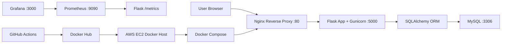
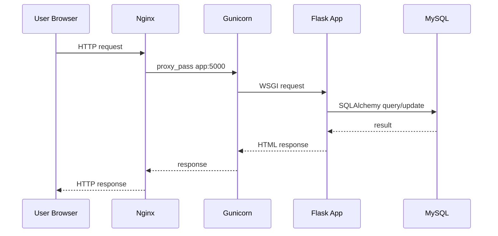
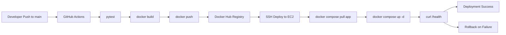
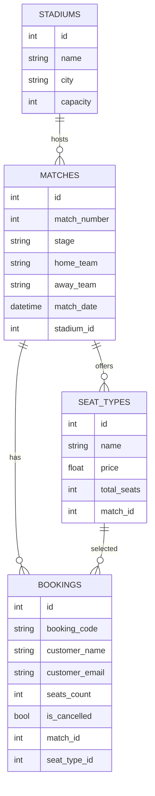
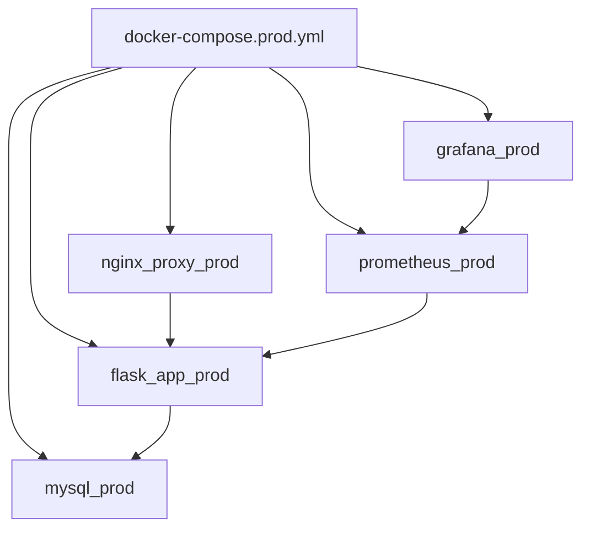
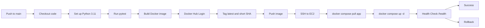
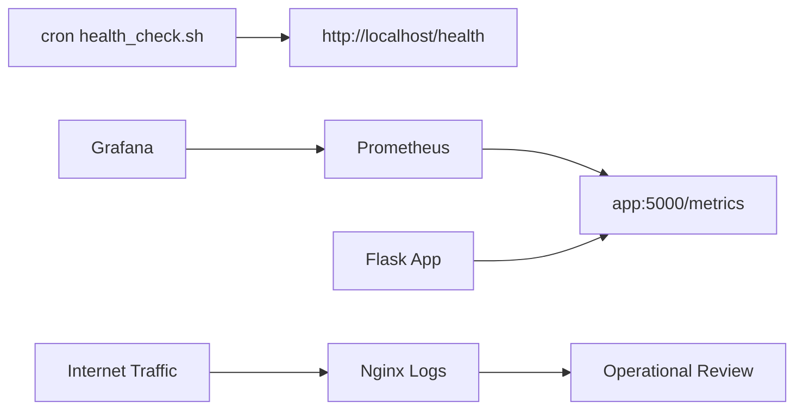
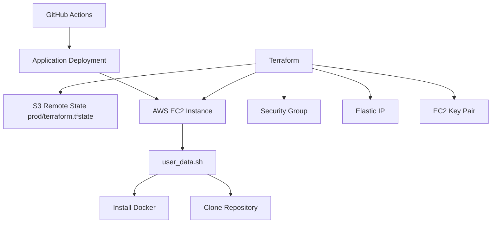

# ספר פרויקט גמר DevOps

## 1. שער

**Project name:** World Cup Seat Booking DevOps Project  
**Student name:** ______________________________  
**ID:** ______________________________  
**College:** ______________________________  
**Program:** DevOps  
**Instructor:** ______________________________  
**Submission date:** ______________________________  

---

## 2. תוכן עניינים

1. שער  
2. תוכן עניינים  
3. תקציר  
4. מבוא  
5. רקע DevOps  
6. מטרות הפרויקט  
7. ניתוח מערכת  
8. ארכיטקטורת המערכת  
9. מבנה תיקיות הפרויקט  
10. לוגיקת האפליקציה  
11. תכנון בסיס הנתונים  
12. Docker  
13. Docker Compose  
14. Nginx ו־Gunicorn  
15. GitHub Actions CI/CD  
16. Docker Hub  
17. AWS EC2 ו־Security Groups  
18. Monitoring  
19. DevSecOps  
20. Terraform  
21. Testing  
22. בעיות ופתרונות במהלך הפיתוח  
23. אבטחה ו־Secrets  
24. סיכום ושיפורים עתידיים  
25. נספחים  

---

## 3. תקציר

פרויקט זה מציג מערכת Web להזמנת מקומות למשחקי World Cup 2026, שנבנתה סביב אפליקציית Flask ומסד נתונים MySQL. המערכת מאפשרת צפייה במשחקים, בחירת סוג מושב, יצירת הזמנה, ניהול הזמנה קיימת, ביטול הזמנה, וצפייה ניהולית בהזמנות ובסטטיסטיקות.

מוקד הפרויקט הוא מחזור חיים מלא של DevOps. האפליקציה נארזת באמצעות Docker, מורצת יחד עם שירותים נוספים באמצעות Docker Compose, נחשפת דרך Nginx, רצה באמצעות Gunicorn, נבדקת ומופצת דרך GitHub Actions, נשמרת כ־Docker image ב־Docker Hub, ונפרסת לשרת AWS EC2.

בנוסף, הפרויקט כולל שכבת ניטור המבוססת על health endpoint, metrics endpoint, Prometheus ו־Grafana. שכבת התשתית מנוהלת באמצעות Terraform, כולל שימוש ב־S3 remote backend לשמירת state קבוע.

---

## 4. מבוא

הפרויקט נבנה כפרויקט גמר בתחום DevOps. מטרתו אינה לבנות מערכת כרטיסים מסחרית מורכבת, אלא להציג מערכת Web פשוטה וברורה שסביבה מיושם תהליך DevOps מלא מקצה לקצה.

ליבת המערכת היא אפליקציית Flask שמציגה משחקי World Cup 2026 ומאפשרת הזמנת מקומות. סביב האפליקציה נבנו תשתיות ותהליכים שמדמים סביבת production: מסד נתונים MySQL, הפעלה בקונטיינרים, reverse proxy, pipeline אוטומטי, deployment לשרת ענן, בדיקות, ניטור וניהול תשתית כקוד.

מבנה זה מאפשר לבחון את הפרויקט גם מהצד האפליקטיבי וגם מהצד התפעולי. הבוחן יכול לראות כיצד קוד משתנה, נבדק, נארז, מופץ, נפרס ומנוטר.

---

## 5. רקע DevOps

גישת DevOps מחברת בין פיתוח תוכנה לבין תפעול מערכות. בעולם מסורתי, צוות פיתוח עשוי לכתוב קוד ולהעביר אותו ידנית לצוות תפעול. תהליך כזה עלול ליצור תקלות, חוסר עקביות בין סביבות, קושי בשחזור גרסאות וזמן תגובה איטי.

בגישת DevOps, התהליך הופך לאוטומטי, מדיד וחוזר על עצמו. הקוד נשמר במערכת ניהול גרסאות, בדיקות רצות אוטומטית, סביבת ההרצה מוגדרת בקבצים, ותהליך הפריסה מתבצע בצורה מבוקרת.

בפרויקט זה עקרונות DevOps באים לידי ביטוי בכמה שכבות:

- ניהול קוד באמצעות Git ו־GitHub.
- בדיקות אוטומטיות באמצעות pytest.
- אריזת האפליקציה באמצעות Docker.
- הרצת כמה שירותים יחד באמצעות Docker Compose.
- פרסום Docker image ל־Docker Hub.
- פריסה אוטומטית ל־AWS EC2 באמצעות GitHub Actions.
- ניטור באמצעות health checks, Prometheus ו־Grafana.
- ניהול תשתית באמצעות Terraform.
- בדיקות אבטחה כחלק מתהליך DevSecOps.

---

## 6. מטרות הפרויקט

מטרות הפרויקט מתחלקות למטרות אפליקטיביות ולמטרות DevOps.

### 6.1 מטרות אפליקטיביות

- בניית אפליקציית Flask להצגת משחקים והזמנת מקומות.
- שמירת מידע במסד נתונים MySQL.
- שימוש ב־SQLAlchemy ORM לעבודה נוחה מול טבלאות.
- יצירת מנגנון הזמנה הכולל קוד הזמנה ייחודי.
- תמיכה בביטול הזמנות.
- הוספת אזור ניהול בסיסי לצפייה בהזמנות ובסטטיסטיקות.

### 6.2 מטרות DevOps

- אריזת האפליקציה כ־Docker image.
- שימוש בכלי Docker Compose להרצת כמה שירותים יחד.
- שימוש ב־Nginx כ־reverse proxy.
- הרצת Flask באמצעות Gunicorn בסביבת container.
- בניית CI/CD pipeline באמצעות GitHub Actions.
- פרסום images ל־Docker Hub.
- פריסה לשרת AWS EC2.
- ניטור באמצעות `/health`, `/metrics`, Prometheus ו־Grafana.
- הוספת בדיקות אבטחה באמצעות כלי DevSecOps.
- ניהול תשתית AWS באמצעות Terraform.

---

## 7. ניתוח מערכת

### 7.1 משתמשים ושחקנים במערכת

| Actor | תפקיד |
| --- | --- |
| Regular user | צפייה במשחקים, יצירת הזמנה, ניהול הזמנה וביטול הזמנה |
| Admin user | התחברות לאזור ניהול וצפייה בהזמנות ובסטטיסטיקות |
| Developer | פיתוח קוד, דחיפה ל־GitHub והפעלת תהליך CI/CD |
| GitHub Actions runner | הרצת בדיקות, בניית image, פרסום ופריסה |
| AWS EC2 server | שרת Linux שמריץ את Docker Compose stack |
| Prometheus | איסוף metrics מהאפליקציה |
| Grafana | הצגת metrics שנאספו ב־Prometheus |

### 7.2 דרישות פונקציונליות

- הצגת רשימת משחקים.
- הצגת פרטי משחק.
- הצגת סוגי מושבים ומחירים.
- יצירת הזמנה לפי שם, אימייל, סוג מושב וכמות.
- יצירת קוד הזמנה ייחודי.
- חיפוש הזמנה לפי קוד ואימייל.
- ביטול הזמנה קיימת.
- התחברות מנהל.
- צפייה בהזמנות ובסטטיסטיקות.
- בדיקת זמינות המערכת דרך `/health`.
- חשיפת metrics דרך `/metrics`.

### 7.3 דרישות לא פונקציונליות

- הרצה עקבית בסביבות שונות באמצעות Docker.
- שמירת נתונים באמצעות volume של MySQL.
- תהליך deployment אוטומטי ומבוקר.
- בדיקת תקינות אחרי deployment.
- יכולת rollback לגרסה קודמת במקרה כשל.
- שמירת secrets מחוץ לקוד.
- ניטור בסיסי של זמינות ותעבורה.
- ניהול תשתית בצורה חוזרת באמצעות Terraform.

### 7.4 גבולות המערכת

המערכת מתמקדת באפליקציית Web ובתהליך DevOps מלא עבורה. הממשק למשתמש מבוסס דפי HTML שנוצרים בצד השרת באמצעות Flask templates. בנוסף קיימים endpoints טכניים לניטור ולבדיקות, כגון `/health` ו־`/metrics`.

הפרויקט מיועד להדגים סביבת production-style בסיסית וברורה: שרת יחיד, Docker Compose, מסד נתונים containerized, ניטור ותהליך CI/CD.

---

## 8. ארכיטקטורת המערכת

הארכיטקטורה בנויה כשכבות ברורות. המשתמש ניגש ל־Nginx דרך HTTP. Nginx מעביר את הבקשה אל אפליקציית Flask שרצה באמצעות Gunicorn. האפליקציה משתמשת ב־SQLAlchemy כדי לקרוא ולכתוב נתונים במסד MySQL.

במקביל, תהליך ה־CI/CD פועל מחוץ לאפליקציה: GitHub Actions בונה Docker image, מפרסם אותו ל־Docker Hub, ומפעיל deployment ל־AWS EC2, שבו Docker Compose מריץ את השירותים.

### Diagram 1: Overall Architecture

התרשים הבא מציג את רכיבי המערכת המרכזיים ואת הקשרים ביניהם.



הזרימה המרכזית היא מהמשתמש אל Nginx ומשם לאפליקציה ולמסד הנתונים. רכיבי Prometheus ו־Grafana פועלים בצד הניטור, ואינם חלק ישיר מתהליך הזמנת הכרטיסים.

### Diagram 2: Request Flow

התרשים הבא מציג את מסלול הבקשה של משתמש רגיל במערכת.



המשתמש אינו פונה ישירות ל־Flask. שכבת Nginx מקבלת את הבקשה הציבורית ומעבירה אותה לשירות הפנימי.

### Diagram 3: CI/CD Deployment Architecture

התרשים הבא מציג את זרימת הפריסה האוטומטית.



ה־pipeline שומר על עקביות: אותה תמונת Docker שנבדקה ונבנתה היא התמונה שנמשכת לשרת.

---

## 9. מבנה תיקיות הפרויקט

מבנה התיקיות המרכזי של הפרויקט:

```text
seat-booking-devops/
|-- app.py
|-- requirements.txt
|-- Dockerfile
|-- docker-compose.yml
|-- docker-compose.prod.yml
|-- seed_world_cup_2026.py
|-- .env.example
|-- README.md
|-- db/
|   `-- mysqld.cnf
|-- nginx/
|   `-- nginx.conf
|-- monitoring/
|   |-- health_check.sh
|   |-- install_cron.sh
|   |-- prometheus/
|   |   `-- prometheus.yml
|   `-- grafana/
|       `-- provisioning/
|-- static/
|   |-- css/
|   `-- images/
|-- templates/
|   |-- base.html
|   |-- index.html
|   |-- match_detail.html
|   |-- booking_success.html
|   |-- manage_booking.html
|   |-- admin_login.html
|   `-- admin_bookings.html
|-- terraform/
|   |-- main.tf
|   |-- variables.tf
|   |-- outputs.tf
|   |-- user_data.sh
|   `-- README.md
|-- tests/
|   `-- test_health.py
`-- .github/
    `-- workflows/
        |-- ci-cd.yml
        |-- security.yml
        |-- terraform.yml
        `-- terraform-destroy.yml
```

הקובץ `app.py` כולל את לוגיקת Flask, המודלים וה־routes. תיקיית `templates/` כוללת את דפי ה־HTML. תיקיית `static/` כוללת CSS ותמונות. תיקיית `nginx/` כוללת את הגדרת reverse proxy.

תיקיית `monitoring/` מרכזת את קבצי הבריאות והניטור. תיקיית `terraform/` כוללת את הגדרת התשתית בענן. תיקיית `.github/workflows/` כוללת את תהליכי CI/CD, security ו־Terraform.

---

## 10. לוגיקת האפליקציה

האפליקציה בנויה סביב routes של Flask ותבניות HTML. המשתמש עובד דרך דפדפן, והשרת מחזיר דפים מוכנים להצגה.

### 10.1 דף הבית ורשימת משחקים

דף הבית מציג את רשימת המשחקים לפי תאריך ומספר משחק. הנתונים נטענים ממסד הנתונים באמצעות SQLAlchemy.

```python
@app.route('/', methods=["GET"])
def index():
    matches = Match.query.order_by(
        Match.match_date,
        Match.match_number,
    ).all()
    from seed_world_cup_2026 import TEAM_FLAGS

    return render_template("index.html", matches=matches, team_flags=TEAM_FLAGS)
```

**מיקום:** `app.py`  
**תפקיד:** טעינת משחקים והצגת עמוד הבית.  
**חשיבות:** זהו מסך הכניסה המרכזי למערכת.

### 10.2 פרטי משחק וסוגי מושבים

בעמוד פרטי משחק המשתמש יכול לראות מידע על המשחק ולבחור סוג מושב. סוגי המושבים מוגדרים בטבלת `seat_types` וכוללים מחיר וכמות זמינה.

### 10.3 יצירת הזמנה

יצירת הזמנה מתבצעת באמצעות route מסוג `POST`. הקוד בודק שהוזנו שם, אימייל, סוג מושב וכמות תקינה. לאחר מכן נוצרת רשומת `Booking` ונשמרת במסד הנתונים.

```python
booking = Booking(
    customer_name=customer_name,
    customer_email=customer_email,
    seats_count=seats_count,
    match=match,
    seat_type=selected_seat_type,
)
db.session.add(booking)
db.session.commit()
```

**מיקום:** `app.py`  
**תפקיד:** שמירת הזמנה חדשה.  
**חשיבות:** זהו התהליך העסקי המרכזי של האפליקציה.

### 10.4 קוד הזמנה

לכל הזמנה נוצר `booking_code` ייחודי באמצעות `uuid4`. קוד זה מאפשר למשתמש לחזור להזמנה שלו בלי צורך בחשבון משתמש מלא.

### 10.5 ביטול הזמנה

ביטול הזמנה אינו מוחק את הרשומה. במקום זאת, השדה `is_cancelled` משתנה ל־`True`. גישה זו שומרת היסטוריה ומאפשרת ניתוח נתונים גם אחרי ביטול.

### 10.6 אזור ניהול

אזור הניהול כולל login בסיסי באמצעות `ADMIN_PASSWORD`. לאחר התחברות ניתן לצפות ברשימת הזמנות ובסטטיסטיקות משחקים.

### 10.7 Health ו־Metrics

המערכת כוללת שני endpoints טכניים:

- `/health` מחזיר סטטוס בסיסי של זמינות.
- `/metrics` מחזיר נתונים בפורמט Prometheus.

---

## 11. תכנון בסיס הנתונים

המערכת משתמשת ב־MySQL לשמירת נתונים בסביבת Docker ו־production. בשכבת הקוד נעשה שימוש ב־SQLAlchemy ORM, שמאפשר להגדיר טבלאות באמצעות מחלקות Python.

### 11.1 ישויות מרכזיות

| Entity | תיאור |
| --- | --- |
| `Stadium` | אצטדיון, עיר וקיבולת |
| `Match` | משחק, שלב בטורניר, קבוצות, תאריך ואצטדיון |
| `SeatType` | סוג מושב, מחיר, כמות ומזהה משחק |
| `Booking` | הזמנה, פרטי לקוח, כמות מושבים וקוד הזמנה |

### 11.2 קשרים בין הישויות

- אצטדיון אחד יכול לארח מספר משחקים.
- משחק אחד מתקיים באצטדיון אחד.
- משחק אחד כולל כמה סוגי מושבים.
- הזמנה אחת שייכת למשחק אחד ולסוג מושב אחד.

### Diagram 4: Database ERD

התרשים הבא מציג את הקשרים העיקריים בין טבלאות המערכת.



הקשר בין `Booking` לבין `Match` ו־`SeatType` מאפשר לדעת לאיזה משחק שייכת ההזמנה ואיזה סוג מושב נבחר.

### 11.3 דוגמת מודל SQLAlchemy

```python
class Booking(db.Model):
    __tablename__ = "bookings"

    id = db.Column(db.Integer, primary_key=True)
    booking_code = db.Column(db.String(36), unique=True, nullable=False, default=lambda: str(uuid4()))
    customer_name = db.Column(db.String(100), nullable=False)
    customer_email = db.Column(db.String(120), nullable=False)
    seats_count = db.Column(db.Integer, nullable=False)
    is_cancelled = db.Column(db.Boolean, nullable=False, default=False)
```

**מיקום:** `app.py`  
**תפקיד:** ייצוג טבלת ההזמנות בקוד.  
**חשיבות:** מאפשר עבודה עם הזמנות בצורה מונחית־עצמים במקום כתיבת SQL ידני בכל פעולה.

---

## 12. Docker

כלי Docker מאפשר לארוז אפליקציה יחד עם סביבת ההרצה שלה. במקום להסתמך על התקנות ידניות בשרת, נוצר Docker image שמכיל את הקוד, התלויות ופקודת ההפעלה.

מושגים מרכזיים:

- `Image` הוא תבנית מוכנה להרצה.
- `Container` הוא מופע רץ של image.
- `Volume` מאפשר שמירת נתונים מחוץ למחזור החיים של container.
- `Network` מאפשר לשירותים לדבר ביניהם לפי שמות שירותים.

בפרויקט זה קובץ `Dockerfile` בונה image לאפליקציית Flask:

```dockerfile
FROM python:3.11-slim

WORKDIR /app

COPY requirements.txt .

RUN python -m pip install --no-cache-dir pip==25.3 setuptools==80.9.0 wheel==0.46.2 \
    && pip install --no-cache-dir -r requirements.txt \
    && pip uninstall -y setuptools wheel

COPY . .

CMD ["gunicorn", "-w", "2", "-b", "0.0.0.0:5000", "app:app"]
```

**מיקום:** `Dockerfile`  
**תפקיד:** בניית סביבת הרצה לאפליקציה.  
**חשיבות:** GitHub Actions והשרת משתמשים באותו image, ולכן סביבת ההרצה עקבית יותר.

---

## 13. Docker Compose

לאחר שהאפליקציה נארזה ב־Docker image, יש צורך להריץ אותה יחד עם שירותים נוספים. בפרויקט זה כלי Docker Compose משמש להרצת כמה containers יחד לפי קובץ YAML אחד.

קיימים שני קבצי Compose:

- `docker-compose.yml` להרצה מקומית.
- `docker-compose.prod.yml` להרצת production-style.

### 13.1 שירותים מקומיים

בקובץ `docker-compose.yml` מוגדרים השירותים:

- `nginx`
- `app`
- `mysql`

הקובץ מתאים להרצה מקומית עם build מתוך קוד המקור.

### 13.2 שירותי production-style

בקובץ `docker-compose.prod.yml` מוגדרים השירותים:

| Service | Container | תפקיד |
| --- | --- | --- |
| `nginx` | `nginx_proxy_prod` | נקודת כניסה HTTP |
| `app` | `flask_app_prod` | אפליקציית Flask שרצה עם Gunicorn |
| `mysql` | `mysql_prod` | מסד הנתונים |
| `prometheus` | `prometheus_prod` | איסוף metrics |
| `grafana` | `grafana_prod` | הצגת metrics |

### 13.3 Volumes ו־Networks

ב־Compose נוצרת רשת פנימית שמאפשרת לשירותים לפנות זה לזה לפי שם השירות, למשל `app:5000` או `mysql:3306`.

ה־volumes המרכזיים הם:

- `mysql-prod-data` לשמירת נתוני MySQL.
- `prometheus_data` לשמירת נתוני Prometheus.
- `grafana_data` לשמירת נתוני Grafana.

### Diagram 5: Docker Compose Services

התרשים הבא מציג את שירותי `docker-compose.prod.yml` ואת התלות ביניהם.



ה־container של האפליקציה הוא מרכז המערכת. Nginx מפנה אליו בקשות משתמשים, Prometheus מושך ממנו metrics, והוא עצמו פונה ל־MySQL.

---

## 14. Nginx ו־Gunicorn

שכבת Nginx משמשת כשער הכניסה למערכת. המשתמש פונה לשרת בפורט `80`, ו־Nginx מעביר את הבקשה לאפליקציה הפנימית.

```nginx
location / {
    proxy_pass http://app:5000;
    proxy_set_header Host $host;
    proxy_set_header X-Real-IP $remote_addr;
    proxy_set_header X-Forwarded-For $proxy_add_x_forwarded_for;
    proxy_set_header X-Forwarded-Proto $scheme;
}
```

**מיקום:** `nginx/nginx.conf`  
**תפקיד:** העברת בקשות מ־Nginx אל שירות `app`.  
**חשיבות:** מאפשר להפריד בין נקודת הכניסה הציבורית לבין שירות האפליקציה הפנימי.

שרת Gunicorn מריץ את Flask בתוך container:

```dockerfile
CMD ["gunicorn", "-w", "2", "-b", "0.0.0.0:5000", "app:app"]
```

שילוב זה נפוץ בסביבות production-style: Nginx מטפל בכניסה החיצונית, ו־Gunicorn מפעיל את אפליקציית Python.

---

## 15. GitHub Actions CI/CD

תהליך ה־CI/CD מוגדר בקובץ `.github/workflows/ci-cd.yml`. כאשר מתבצע push ל־`main`, ה־workflow מריץ בדיקות, בונה Docker image, מפרסם אותו ל־Docker Hub ומבצע deployment ל־EC2.

סדר הפעולות המרכזי:

```text
Push -> Tests -> Docker Build -> Docker Push -> SSH Deploy -> Docker Compose Pull/Up -> Health Check -> Rollback
```

### Diagram 6: CI/CD Pipeline

התרשים הבא מציג את שלבי ה־pipeline מהקוד ועד השרת.



ה־pipeline בודק את הקוד לפני הפריסה ומוודא שהגרסה החדשה מגיבה אחרי שעלתה בשרת. במקרה של כשל, מופעל תהליך rollback שמחזיר את ה־image tag הקודם.

### 15.1 תפקיד image tags

ל־Docker image ניתנים שני tags:

- `latest` מייצג את הגרסה האחרונה.
- short commit SHA מייצג גרסה ספציפית לפי commit.

השימוש ב־short SHA חשוב במיוחד ל־rollback, כי הוא מאפשר לחזור לגרסה מוגדרת ולא רק לתג כללי שמשתנה עם הזמן.

---

## 16. Docker Hub

Docker Hub משמש כ־image registry של הפרויקט. לאחר שה־CI/CD בונה את ה־Docker image, הוא מפרסם אותו ל־Docker Hub תחת:

```text
shlomodevops/devops-final-projectshlomo
```

בשרת EC2 אין צורך לבנות את האפליקציה מחדש. במקום זאת, Docker Compose מושך את ה־image שפורסם:

```bash
docker compose --env-file .env -f docker-compose.prod.yml pull app
docker compose --env-file .env -f docker-compose.prod.yml up -d
```

גישה זו מפרידה בין build לבין deployment. ה־build מתבצע ב־GitHub Actions, והשרת אחראי להריץ את הגרסה שנבחרה.

---

## 17. AWS EC2 ו־Security Groups

שרת AWS EC2 הוא שרת Linux שעליו רצה סביבת Docker Compose. השרת מחזיק את קבצי הפרויקט, קובץ `.env` מקומי, Docker Engine, ואת כל שירותי ה־production-style.

קבוצת Security Group משמשת כ־firewall ברמת AWS. היא קובעת אילו פורטים פתוחים ומאילו כתובות ניתן להתחבר.

### 17.1 פורטים מרכזיים

| Port | שימוש |
| --- | --- |
| `22` | SSH לניהול השרת ול־deployment |
| `80` | HTTP דרך Nginx |
| `3000` | Grafana |
| `9090` | Prometheus |

גישה ל־SSH צריכה להיות מוגבלת ל־CIDR אישי. גם גישה ל־Grafana ול־Prometheus צריכה להיות מוגבלת, מכיוון שמדובר בכלי תפעוליים שמציגים מידע על המערכת.

---

## 18. Monitoring

שכבת הניטור בפרויקט נועדה לענות על שתי שאלות: האם האפליקציה זמינה, ומה קורה בה מבחינת בקשות ו־metrics.

### 18.1 Health endpoint

ה־endpoint `/health` מחזיר תשובה פשוטה כאשר האפליקציה מגיבה:

```python
@app.route('/health', methods=["GET"])
def health():
    return {"status": "ok"}, 200
```

בדיקה זו משמשת את ה־CI/CD אחרי deployment ואת סקריפט הבריאות שרץ בשרת.

### 18.2 Health check script ו־cron

הקובץ `monitoring/health_check.sh` מבצע בדיקה לכתובת:

```bash
http://localhost/health
```

אם הבדיקה נכשלת כמה פעמים, הסקריפט מתעד מידע לוגים, מציג מצב containers ומנסה להפעיל מחדש את `flask_app_prod`. הקובץ `monitoring/install_cron.sh` מתקין cron job שמריץ את הבדיקה כל חמש דקות.

### 18.3 Metrics endpoint

ה־endpoint `/metrics` מחזיר metrics בפורמט ש־Prometheus יודע לקרוא:

```python
@app.route('/metrics', methods=["GET"])
def metrics():
    return generate_latest(), 200, {"Content-Type": CONTENT_TYPE_LATEST}
```

בנוסף מוגדר counter בשם `flask_http_requests_total`, שמודד בקשות לפי method, endpoint ו־status.

### 18.4 Prometheus

Prometheus מושך נתונים מהאפליקציה כל 15 שניות לפי ההגדרה:

```yaml
scrape_configs:
  - job_name: flask_app
    metrics_path: /metrics
    static_configs:
      - targets:
          - app:5000
```

### 18.5 Grafana

Grafana מחובר ל־Prometheus כ־datasource ומאפשר להציג את הנתונים בצורה גרפית. בפרויקט קיימת הגדרת provisioning שמגדירה את Prometheus כ־datasource ברירת מחדל.

### Diagram 7: Monitoring Flow

התרשים הבא מציג את זרימת הניטור במערכת.



במערכת ניתן לראות גם בקשות חיצוניות חשודות שמגיעות מהאינטרנט. בקשות כאלה מופיעות בלוגים של Nginx ובמדדים, ולכן חשוב לדעת להבחין בין תעבורה אמיתית לבין סריקות אוטומטיות.

---

## 19. DevSecOps

DevSecOps מוסיף שכבת אבטחה לתהליך DevOps. במקום לבצע בדיקות אבטחה רק בסוף הפרויקט, הבדיקות משולבות בתוך תהליך העבודה האוטומטי.

בפרויקט זה קיים workflow בשם `.github/workflows/security.yml`, שמריץ כמה כלים:

| Tool | תפקיד |
| --- | --- |
| `Gitleaks` | בדיקה שלא הוכנסו secrets לריפוזיטורי |
| `Bandit` | בדיקת בעיות אבטחה נפוצות בקוד Python |
| `pip-audit` | בדיקת vulnerabilities בחבילות Python |
| `Hadolint` | בדיקת איכות ואבטחה של Dockerfile |
| `Trivy` | סריקת vulnerabilities בתוך Docker image |

בדיקות אלה מחזקות את ה־CI/CD. הן אינן מחליפות תכנון אבטחה מלא, אך הן מוסיפות שכבת בדיקה אוטומטית שמקטינה סיכון להעלאת קוד או image עם בעיות ידועות.

---

## 20. Terraform

Terraform משמש בפרויקט ככלי Infrastructure as Code. במקום ליצור משאבי AWS בצורה ידנית בלבד, התשתית מוגדרת בקבצי `.tf` שניתן להריץ, לבדוק ולעדכן בצורה עקבית.

בפרויקט זה Terraform אחראי לשכבת התשתית, GitHub Actions אחראי לפריסת האפליקציה, ו־Docker אחראי להרצת השירותים.

### 20.1 קבצי Terraform

| File | תפקיד |
| --- | --- |
| `terraform/main.tf` | הגדרת provider, backend ומשאבי AWS |
| `terraform/variables.tf` | משתנים כמו region, instance type ו־CIDR |
| `terraform/outputs.tf` | פלטים כמו public IP, app URL ו־SSH command |
| `terraform/user_data.sh` | התקנת Docker/Git והכנת השרת |
| `.github/workflows/terraform.yml` | בדיקת Terraform והרצת plan/apply ידני |

### 20.2 משאבי AWS

Terraform יוצר או מנהל את הרכיבים הבאים:

- EC2 instance להרצת Docker Compose.
- Security Group להגדרת גישה לרשת.
- Elastic IP לכתובת ציבורית יציבה.
- Key Pair במקרה שלא סופק key pair קיים.
- שימוש ב־default VPC ו־default subnets.

### 20.3 תפקיד `user_data.sh`

הקובץ `terraform/user_data.sh` רץ בעת יצירת השרת ומכין אותו לעבודה:

- מתקין Docker ו־Docker Compose plugin.
- מתקין Git.
- מפעיל את שירות Docker.
- משכפל או מעדכן את הריפוזיטורי.
- מוודא שהמשתמש `ubuntu` יכול לעבוד עם Docker.

### 20.4 S3 Remote State

קובץ state של Terraform שומר את הקשר בין הגדרות Terraform לבין משאבי AWS שנוצרו בפועל. בפרויקט זה ה־state נשמר ב־S3:

```hcl
backend "s3" {
  bucket       = "seat-booking-devops-tfstate-shlomo-2026"
  key          = "prod/terraform.tfstate"
  region       = "eu-north-1"
  use_lockfile = true
}
```

שמירת state ב־S3 חשובה במיוחד עבור GitHub Actions, משום שה־runners זמניים ואינם שומרים קבצים בין הרצות. remote state מאפשר ל־Terraform לזכור אילו משאבים כבר קיימים, לעדכן משאבים קיימים באמצעות `terraform apply`, ולהוסיף תהליכי destroy בצורה בטוחה יותר כאשר state קבוע קיים.

### Diagram 8: Terraform Infrastructure

התרשים הבא מציג את תפקיד Terraform בפרויקט.



התרשים מדגיש את חלוקת האחריות: Terraform מכין ומנהל את התשתית, ולאחר מכן GitHub Actions משתמש בתשתית כדי לפרוס את האפליקציה.

---

## 21. Testing

בדיקות אוטומטיות נכתבו באמצעות pytest ונמצאות בקובץ `tests/test_health.py`. בזמן בדיקות, האפליקציה משתמשת במסד SQLite בזיכרון כדי להריץ בדיקות מהר וללא תלות ב־MySQL חיצוני.

תחומי הבדיקה המרכזיים:

- בדיקת `/health`.
- בדיקת עמוד הבית.
- בדיקת עמוד פרטי משחק.
- בדיקת ניהול הזמנה.
- בדיקת יצירת וביטול הזמנה.
- בדיקת התחברות ויציאה של admin.
- בדיקת נתוני seed של World Cup 2026.
- בדיקת מחירים לפי שלבי הטורניר.

דוגמה לבדיקה:

```python
def test_health_route(client):
    response = client.get("/health")

    assert response.status_code == 200
    assert response.get_json() == {"status": "ok"}
```

בדיקה זו חשובה משום שאותו endpoint משמש גם בתהליך deployment כדי לוודא שהאפליקציה עלתה בהצלחה.

---

## 22. בעיות ופתרונות במהלך הפיתוח

### 22.1 SSH access ו־Security Group CIDR

בעת עבודה עם EC2 יש צורך לאפשר SSH לשרת, אך פתיחת SSH לכל העולם היא סיכון אבטחתי. הפתרון בפרויקט הוא שימוש במשתנה `allowed_ssh_cidr`, שמאפשר להגביל את פורט `22` לכתובת או טווח כתובות מוגדרים.

### 22.2 Elastic IP וזיהוי כתובת קיימת

בסביבת ענן חשוב לשמור כתובת ציבורית יציבה. בפרויקט נוספה אפשרות להשתמש ב־Elastic IP קיים באמצעות `existing_eip_allocation_id`, או ליצור Elastic IP חדש כאשר הערך ריק. כך ניתן לשלוט בהעברת תעבורה לשרת חדש בצורה מסודרת.

### 22.3 התקנת Docker ו־Compose על שרת חדש

שרת EC2 חדש אינו מגיע מוכן להרצת Docker Compose. הפתרון הוא `user_data.sh`, שמתקין Docker, Docker Compose plugin ו־Git בזמן הקמת השרת.

### 22.4 Terraform state

כאשר Terraform רץ מתוך GitHub Actions, לא ניתן להסתמך על state מקומי. הפתרון הוא S3 remote backend, ששומר את state תחת `prod/terraform.tfstate` ומאפשר להרצות שונות לעבוד מול אותו מקור אמת.

### 22.5 Health check ו־Rollback

Deployment עלול להיכשל גם אם image נבנה בהצלחה. לכן ה־pipeline מבצע בדיקת `/health` אחרי ההרצה. אם הבדיקה נכשלת, ה־workflow מחזיר את `IMAGE_TAG` הקודם ומפעיל מחדש את Docker Compose.

---

## 23. אבטחה ו־Secrets

הפרויקט משתמש בכמה שכבות להגנה על מידע רגיש ועל תהליך הפריסה.

### 23.1 קובצי סביבה

הקובץ `.env.example` מציג את המשתנים הדרושים, אך ערכים אמיתיים נשמרים בקובץ `.env` מקומי שאינו נכנס ל־Git.

משתנים מרכזיים:

- `ADMIN_PASSWORD`
- `SECRET_KEY`
- `DB_USER`
- `DB_PASSWORD`
- `DB_NAME`
- `MYSQL_ROOT_PASSWORD`
- `IMAGE_TAG`

### 23.2 GitHub Secrets

GitHub Actions משתמש ב־GitHub Secrets כדי לאחסן מידע רגיש:

- `DOCKERHUB_USERNAME`
- `DOCKERHUB_TOKEN`
- `EC2_HOST`
- `EC2_USER`
- `EC2_SSH_KEY`
- `AWS_ACCESS_KEY_ID`
- `AWS_SECRET_ACCESS_KEY`
- `AWS_REGION`

### 23.3 Flask security configuration

בקוד האפליקציה מוגדרות הגנות session:

- `SESSION_COOKIE_HTTPONLY=True`
- `SESSION_COOKIE_SAMESITE="Lax"`
- `SESSION_COOKIE_SECURE` לפי environment

בנוסף, בסביבת production נדרש להגדיר `SECRET_KEY` ו־`ADMIN_PASSWORD` תקינים.

### 23.4 Security Groups

גישה ל־SSH, Grafana ו־Prometheus צריכה להיות מוגבלת באמצעות CIDR מתאים. פורטים תפעוליים אינם מיועדים להיות פתוחים לכל משתמש באינטרנט.

### 23.5 DevSecOps checks

ה־security workflow מוסיף בדיקות אוטומטיות על secrets, קוד Python, dependencies, Dockerfile ו־Docker image. כך נוצרת שכבת בקרה נוספת לפני הפצה או שימוש ב־image.

---

## 24. סיכום ושיפורים עתידיים

הפרויקט מציג מחזור DevOps מלא עבור אפליקציית Web מבוססת Flask ו־MySQL. הקוד מנוהל ב־GitHub, נבדק באמצעות pytest, נארז באמצעות Docker, מפורסם ל־Docker Hub, נפרס ל־AWS EC2 ומנוטר באמצעות Prometheus ו־Grafana. בנוסף, Terraform מאפשר לנהל את התשתית בצורה חוזרת ומתועדת.

הערך המרכזי של הפרויקט הוא החיבור בין פיתוח לבין תפעול. כל שינוי קוד יכול לעבור תהליך מסודר של בדיקה, בנייה, פרסום, פריסה ואימות.

שיפורים עתידיים אפשריים:

- הוספת HTTPS ותעודת SSL.
- חיבור domain קבוע.
- יצירת dashboards מותאמים אישית ב־Grafana.
- הקשחת הרשאות IAM עבור Terraform ו־GitHub Actions.
- העברת מסד הנתונים לשירות מנוהל כגון RDS.
- חלוקת Terraform למודולים.
- הרחבת בדיקות end-to-end.
- הוספת alerting ל־Prometheus/Grafana.

שיפורים אלה יכולים להרחיב את הפרויקט בעתיד, אך המבנה הנוכחי כבר מדגים בצורה מלאה את עקרונות DevOps המרכזיים.

---

## 25. נספחים

### 25.1 פקודות חשובות

| Command | תפקיד |
| --- | --- |
| `docker compose up --build` | הרצת סביבת development |
| `docker compose --env-file .env -f docker-compose.prod.yml up -d` | הרצת סביבת production-style |
| `docker compose --env-file .env -f docker-compose.prod.yml pull app` | משיכת image חדש |
| `curl http://localhost/health` | בדיקת זמינות מתוך השרת |
| `pytest` | הרצת בדיקות |
| `docker logs --tail=120 flask_app_prod` | צפייה בלוגים של האפליקציה |
| `docker logs --tail=80 nginx_proxy_prod` | צפייה בלוגים של Nginx |
| `docker inspect flask_app_prod --format='{{.Config.Image}}'` | בדיקת image שרץ בפועל |
| `terraform init` | אתחול Terraform |
| `terraform fmt -check` | בדיקת formatting |
| `terraform validate` | בדיקת תקינות Terraform |
| `terraform plan` | תכנון שינויי תשתית |
| `terraform apply` | החלת שינויי תשתית |

### 25.2 מקומות לשילוב צילומי מסך

ניתן להוסיף למסמך הסופי צילומי מסך במקומות הבאים:

- עמוד הבית של האפליקציה.
- עמוד פרטי משחק.
- עמוד אישור הזמנה.
- מסך admin bookings.
- GitHub Actions successful run.
- Docker Hub repository.
- Grafana dashboard.
- Prometheus targets.
- AWS EC2 instance.
- Terraform plan/apply output.

### 25.3 קטעי קוד נבחרים

#### Health endpoint

```python
@app.route('/health', methods=["GET"])
def health():
    return {"status": "ok"}, 200
```

קטע זה מאפשר ל־CI/CD ולסקריפט health check לוודא שהאפליקציה זמינה.

#### Metrics endpoint

```python
@app.route('/metrics', methods=["GET"])
def metrics():
    return generate_latest(), 200, {"Content-Type": CONTENT_TYPE_LATEST}
```

קטע זה מאפשר ל־Prometheus למשוך metrics מהאפליקציה.

#### Production image

```yaml
image: shlomodevops/devops-final-projectshlomo:${IMAGE_TAG:-latest}
```

קטע זה מאפשר לשרת להריץ image לפי תג שנקבע ב־CI/CD.

#### Terraform backend

```hcl
backend "s3" {
  bucket       = "seat-booking-devops-tfstate-shlomo-2026"
  key          = "prod/terraform.tfstate"
  region       = "eu-north-1"
  use_lockfile = true
}
```

קטע זה מגדיר state מרוחק וקבוע עבור Terraform.

### 25.4 הסבר קצר על workflows

| Workflow | תפקיד |
| --- | --- |
| `ci-cd.yml` | בדיקות, build, push ל־Docker Hub ו־deployment ל־EC2 |
| `security.yml` | בדיקות DevSecOps |
| `terraform.yml` | בדיקת Terraform ו־apply ידני |
| `terraform-destroy.yml` | מחיקת תשתית בהרצה ידנית מבוקרת |

### 25.5 פקודות Terraform

```bash
cd terraform
terraform init
terraform fmt -check
terraform validate
terraform plan
terraform apply
```

פקודות אלו משמשות לבדיקה ולהחלה של הגדרות התשתית. בסביבת GitHub Actions הן מבוצעות מתוך workflow ייעודי.

