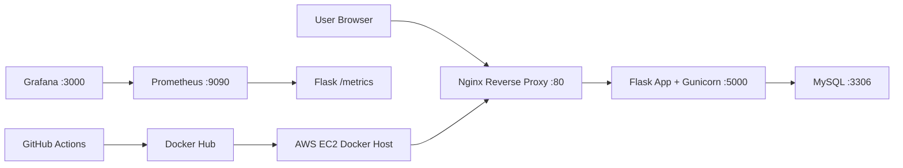
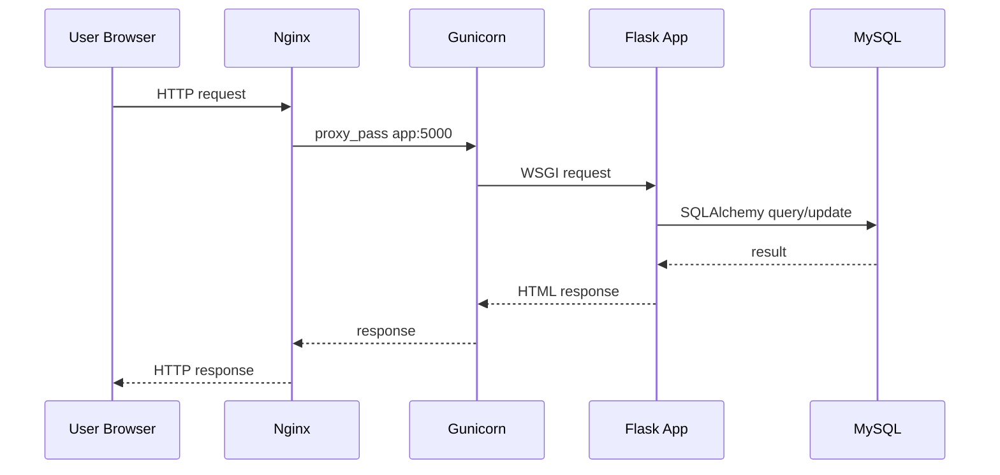
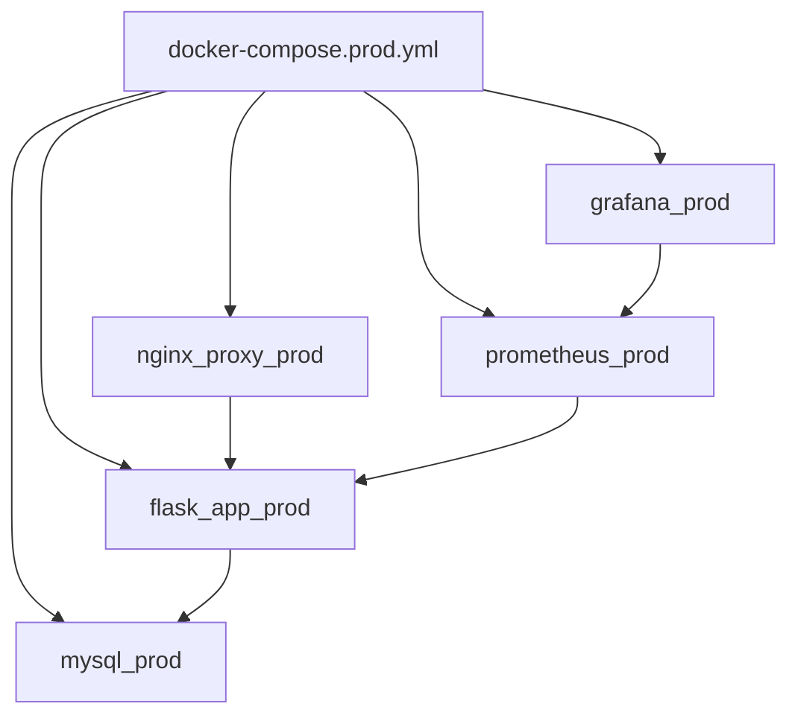
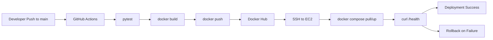
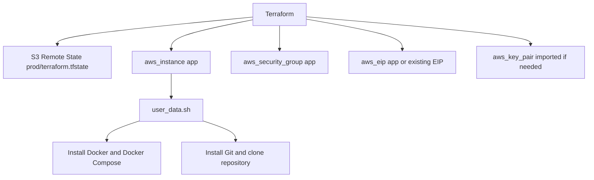
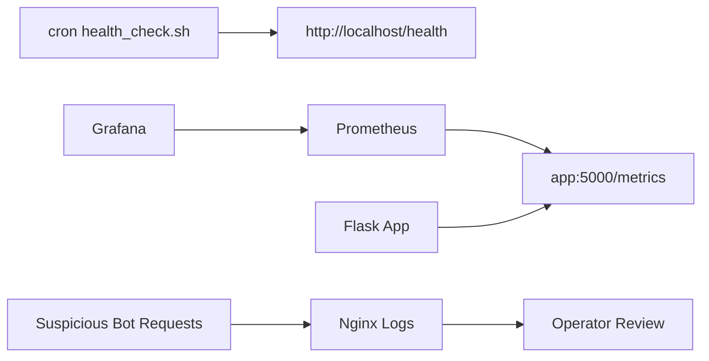

# ספר פרויקט גמר DevOps

## 1. שער

**שם הפרויקט:** World Cup Seat Booking DevOps Project  
**תחום:** DevOps, Web Application, Cloud Infrastructure, CI/CD, Monitoring  
**טכנולוגיות מרכזיות:** Flask, MySQL, SQLAlchemy, Docker, Docker Compose, Nginx, Gunicorn, GitHub Actions, Docker Hub, AWS EC2, Terraform, Prometheus, Grafana  
**תוצר:** מערכת Web להזמנת מקומות למשחקי World Cup 2026, עם תהליך בנייה, בדיקות, הפצה, פריסה וניטור.

המסמך נכתב על בסיס סריקה של קבצי הריפוזיטורי בפועל. רכיבים שלא נמצאו בקבצי הפרויקט אינם מוצגים כחלק מהמערכת.

---

## 2. תקציר

הפרויקט הוא מערכת Web להזמנת מקומות למשחקי World Cup 2026. המשתמש יכול לצפות ברשימת משחקים, לבחור משחק, לבחור סוג מושב, לבצע הזמנה, לצפות בפרטי ההזמנה ולבטל הזמנה קיימת. בנוסף קיימת עמדת ניהול בסיסית למנהל, הכוללת התחברות וצפייה בהזמנות ובסטטיסטיקות משחקים.

מבחינת DevOps, הפרויקט מדגים מחזור חיים מלא של אפליקציה: פיתוח אפליקציית Flask, חיבור למסד נתונים MySQL, הרצה בקונטיינרים, Reverse Proxy באמצעות Nginx, הרצת האפליקציה ב־Gunicorn, בדיקות אוטומטיות, בניית Docker image, פרסום ל־Docker Hub, פריסה לשרת AWS EC2 באמצעות GitHub Actions, וניטור באמצעות `/health`, `/metrics`, Prometheus ו־Grafana.

המערכת אינה מבוססת Kubernetes, Jenkins, Load Balancer, HTTPS, Domain, RDS או REST API אפליקטיבי. לא נמצא בקבצי הפרויקט שימוש בפועל ברכיבים אלו. המערכת מבוססת Flask routes רגילים, וכן כוללת endpoints טכניים כגון `/health` ו־`/metrics` לצורך בדיקות וניטור.

Terraform קיים בפרויקט ומשמש ליצירת תשתית AWS: שרת EC2, Security Group, Elastic IP, Key Pair במידת הצורך, והתקנת Docker/Git על השרת באמצעות `user_data.sh`. חשוב להפריד בין תחומי האחריות: Terraform יוצר תשתית, ואילו GitHub Actions מבצע Deployment של האפליקציה.

---

## 3. תוכן עניינים

1. שער  
2. תקציר  
3. תוכן עניינים  
4. מבוא  
5. מטרת הפרויקט  
6. תיאור הבעיה  
7. פתרון מוצע  
8. ניתוח מערכת  
9. תכנון מערכת  
10. ארכיטקטורת המערכת  
11. בסיס הנתונים  
12. מבנה הקבצים והתיקיות  
13. תיאור רכיבי המערכת  
14. Docker  
15. Docker Compose  
16. Nginx  
17. Flask / Gunicorn  
18. MySQL / SQLAlchemy  
19. Git ו־GitHub  
20. GitHub Actions  
21. Docker Hub / Registry  
22. AWS EC2  
23. Security Groups  
24. Terraform  
25. Prometheus  
26. Grafana  
27. Health Check ו־Monitoring  
28. בדיקות  
29. בעיות שהתגלו במהלך הפיתוח ופתרונות  
30. אבטחה ו־Secrets  
31. סיכום ומסקנות  
32. נספחים  

---

## 4. מבוא

פרויקט DevOps נמדד לא רק לפי קוד האפליקציה, אלא לפי היכולת להעביר את הקוד בצורה מסודרת מסביבת פיתוח לסביבת הרצה. בפרויקט זה נבנתה אפליקציית Flask קטנה וברורה, וסביבה הוקמה מעטפת DevOps מלאה: Docker image, Docker Compose, CI/CD, שרת EC2, ניטור בסיסי ותשתית Terraform.

הדומיין של הפרויקט הוא הזמנת מקומות למשחקי World Cup 2026. הקבצים כוללים נתוני seed עבור משחקים, אצטדיונים, סוגי מושבים ומחירים לפי שלב בטורניר. המטרה אינה לבנות מערכת מסחרית מלאה, אלא להציג פרויקט גמר שמדגים עקרונות אמיתיים של פיתוח, אריזה, פריסה, ניטור ותפעול.

---

## 5. מטרת הפרויקט

מטרת הפרויקט היא לבנות מערכת Web עובדת ולחבר אליה תהליך DevOps מלא וברור:

- אפליקציית Flask עם תבניות HTML.
- שמירת מידע במסד נתונים MySQL.
- שימוש ב־SQLAlchemy ORM למיפוי מודלים לטבלאות.
- הרצה בקונטיינרים עם Docker.
- ניהול כמה שירותים יחד עם Docker Compose.
- שימוש ב־Nginx כ־Reverse Proxy.
- הפעלת Flask ב־Gunicorn בסביבת Docker.
- בדיקות אוטומטיות עם pytest.
- CI/CD עם GitHub Actions.
- בניית Docker image ופרסום ל־Docker Hub.
- Deployment לשרת AWS EC2 דרך SSH.
- ניטור באמצעות `/health`, `/metrics`, Prometheus, Grafana וסקריפט cron.
- יצירת תשתית AWS באמצעות Terraform.

---

## 6. תיאור הבעיה

בפרויקטי Web רבים הבעיה אינה רק כתיבת הקוד. גם אם האפליקציה עובדת מקומית, עדיין צריך לפתור שאלות תפעוליות:

- איך מריצים את אותה אפליקציה בסביבה נקייה?
- איך שומרים נתונים בצורה מתמשכת?
- איך מעדכנים גרסה בשרת בלי לבצע פעולות ידניות רבות?
- איך בודקים שהאפליקציה חיה אחרי deployment?
- איך חוזרים לגרסה קודמת אם deployment נכשל?
- איך רואים תעבורה, כשלים ובקשות בזמן אמת?
- איך יוצרים תשתית בענן בצורה מתועדת וחוזרת?

הפרויקט נותן מענה לשאלות אלו באמצעות כלים מקובלים בעולם DevOps, אך נשאר מספיק קטן כדי שאפשר יהיה להסביר אותו מקצה לקצה.

---

## 7. פתרון מוצע

הפתרון המוצע הוא אפליקציית Flask שמורצת בתוך Docker container, מתחברת ל־MySQL container, ונחשפת למשתמש דרך Nginx. בסביבת production מתווספים Prometheus ו־Grafana לצורך ניטור.

ה־CI/CD מבוצע דרך GitHub Actions:

1. הרצת בדיקות.
2. בניית Docker image.
3. פרסום image ל־Docker Hub.
4. התחברות ל־EC2 דרך SSH.
5. עדכון הקוד וה־`IMAGE_TAG`.
6. הרצת `docker compose`.
7. בדיקת `/health`.
8. Rollback אוטומטי אם health check נכשל.

Terraform משמש לשכבת התשתית: יצירת EC2, Security Group, Elastic IP והתקנת Docker/Git. לאחר שהתשתית קיימת, GitHub Actions אחראי לפריסת האפליקציה.

---

## 8. ניתוח מערכת

### 8.1 משתמשים במערכת

| Role | Description |
| --- | --- |
| Regular user | צופה במשחקים, מזמין מקומות, מנהל הזמנה קיימת ומבטל הזמנה |
| Admin user | מתחבר למסך ניהול וצופה בהזמנות ובסטטיסטיקות |
| Developer | דוחף קוד ל־GitHub ומפעיל את תהליך ה־CI/CD |
| GitHub Actions runner | מריץ בדיקות, בונה image, מפרסם ל־Docker Hub ומבצע deployment |
| Prometheus | מושך metrics מ־`/metrics` |
| Grafana | מציג נתונים מ־Prometheus |

### 8.2 יכולות עיקריות

- צפייה בעמוד הבית וברשימת משחקים.
- צפייה בפרטי משחק.
- הזמנת מושבים לפי סוג מושב וכמות.
- יצירת `booking_code` ייחודי.
- חיפוש הזמנה לפי קוד ואימייל.
- ביטול הזמנה.
- התחברות מנהל.
- צפייה בהזמנות ובסטטיסטיקות.
- בדיקת בריאות דרך `/health`.
- חשיפת metrics דרך `/metrics`.

### 8.3 REST API

בבדיקת `app.py` לא נמצאו REST API endpoints אפליקטיביים בסגנון:

```text
GET /api/...
POST /api/...
DELETE /api/...
```

לכן לא נכון לתאר את הפרויקט כפרויקט REST API. המערכת מבוססת Flask routes רגילים שמחזירים HTML דרך Jinja templates, וכן כוללת endpoints טכניים כגון `/health` ו־`/metrics` לצורך בדיקות וניטור.

---

## 9. תכנון מערכת

התכנון מחולק לשלוש שכבות:

| Layer | Responsibility |
| --- | --- |
| Application | Flask routes, templates, business logic, sessions, bookings |
| Runtime | Docker, Docker Compose, Nginx, Gunicorn, MySQL |
| DevOps / Infrastructure | GitHub Actions, Docker Hub, AWS EC2, Terraform, Prometheus, Grafana |

התכנון שומר על הפרדה בין קוד האפליקציה לבין תשתית ההרצה:

- Flask אינו יודע שהוא רץ על EC2.
- Docker Compose מגדיר את השירותים והקשרים ביניהם.
- GitHub Actions מבצע deployment.
- Terraform מייצר את התשתית.
- Prometheus/Grafana עוסקים בניטור.

---

## 10. ארכיטקטורת המערכת

### 10.1 Overall Architecture



### 10.2 Request Flow



### 10.3 Docker Compose Services



### 10.4 CI/CD Pipeline



### 10.5 Terraform Infrastructure



### 10.6 Monitoring Flow



---

## 11. בסיס הנתונים

הפרויקט משתמש ב־MySQL בסביבת Docker ו־production. עבור בדיקות אוטומטיות, הקוד משתמש ב־SQLite in-memory כאשר `TESTING=true`.

החיבור ל־MySQL מוגדר ב־`app.py` באמצעות משתני סביבה:

```python
app.config['SQLALCHEMY_DATABASE_URI'] = 'mysql+pymysql://{}:{}@{}/{}'.format(
    os.getenv('DB_USER', 'flask'),
    os.getenv('DB_PASSWORD', 'change-me'),
    os.getenv('DB_HOST', 'mysql'),
    os.getenv('DB_NAME', 'flask')
)
```

**מיקום הקטע:** `app.py`  
**מה הקטע עושה:** בונה connection string ל־MySQL לפי משתני סביבה.  
**למה הוא חשוב:** מאפשר לאותה אפליקציה לרוץ מול MySQL container בלי לקודד סיסמאות בקוד.

### 11.1 מודלים עיקריים

| Model | Table | Purpose |
| --- | --- | --- |
| `Stadium` | `stadiums` | שמירת אצטדיונים, עיר וקיבולת |
| `Match` | `matches` | שמירת משחקים, שלב, קבוצות, תאריך ואצטדיון |
| `SeatType` | `seat_types` | סוגי מושבים, מחיר וכמות זמינה |
| `Booking` | `bookings` | הזמנות משתמשים וקוד הזמנה |

### 11.2 קשרים בין טבלאות

- אצטדיון אחד יכול לארח כמה משחקים.
- משחק אחד שייך לאצטדיון אחד.
- משחק אחד כולל כמה סוגי מושבים.
- הזמנה אחת שייכת למשחק אחד ולסוג מושב אחד.
- ביטול הזמנה מתבצע באמצעות `is_cancelled=True`, ולא מחיקה פיזית של הרשומה.

### 11.3 Seed Data

הקובץ `seed_world_cup_2026.py` יוצר נתוני בסיס:

- אצטדיונים.
- משחקי שלב בתים ונוקאאוט.
- מחירים לפי שלב.
- סוגי מושבים: `Regular`, `Premium`, `VIP`.

בבדיקות נמצא שה־seed יוצר 104 משחקי World Cup 2026.

---

## 12. מבנה הקבצים והתיקיות

### 12.1 Project files

| Path | Purpose |
| --- | --- |
| `app.py` | קוד Flask, מודלים, routes, health, metrics |
| `seed_world_cup_2026.py` | טעינת נתוני משחקים, אצטדיונים, מחירים וסוגי מושבים |
| `requirements.txt` | חבילות Python |
| `Dockerfile` | בניית Docker image של האפליקציה |
| `docker-compose.yml` | הרצה מקומית: nginx, app, mysql |
| `docker-compose.prod.yml` | הרצת production-style: nginx, app, mysql, prometheus, grafana |
| `.env.example` | דוגמת משתני סביבה ללא secrets אמיתיים |
| `.gitignore` | החרגת `.env`, Terraform state, מפתחות וקבצי cache |
| `nginx/nginx.conf` | Reverse proxy מ־Nginx אל `app:5000` |
| `db/mysqld.cnf` | קונפיגורציית MySQL בסיסית |
| `templates/` | תבניות HTML של Flask |
| `static/` | CSS ותמונות |
| `tests/test_health.py` | בדיקות pytest ל־routes ולמודלים |
| `.github/workflows/ci-cd.yml` | בדיקות, build, push ל־Docker Hub ו־deployment ל־EC2 |
| `.github/workflows/security.yml` | בדיקות אבטחה: Gitleaks, Bandit, pip-audit, Hadolint, Trivy |
| `.github/workflows/terraform.yml` | Terraform fmt/init/validate/plan ו־apply ידני |
| `.github/workflows/terraform-destroy.yml` | Terraform destroy ידני |
| `monitoring/health_check.sh` | Health check דרך cron והפעלה מחדש במקרה כשל |
| `monitoring/install_cron.sh` | התקנת cron job |
| `monitoring/prometheus/prometheus.yml` | הגדרת scraping של Prometheus |
| `monitoring/grafana/provisioning/datasources/prometheus.yml` | הגדרת datasource של Grafana |
| `terraform/main.tf` | תשתית AWS ו־S3 backend |
| `terraform/variables.tf` | משתני Terraform |
| `terraform/outputs.tf` | פלטים כמו IP ו־URLs |
| `terraform/user_data.sh` | Bootstrap לשרת EC2 |
| `terraform/README.md` | תיעוד Terraform |

---

## 13. תיאור רכיבי המערכת

### 13.1 Flask Application

האפליקציה נמצאת ב־`app.py`. היא מגדירה routes, session, מודלים של SQLAlchemy, התחברות למסד נתונים, health endpoint ו־metrics endpoint.

Routes שנמצאו:

| Route | Methods | Purpose |
| --- | --- | --- |
| `/` | `GET` | עמוד בית ורשימת משחקים |
| `/health` | `GET` | Health check טכני |
| `/metrics` | `GET` | Prometheus metrics |
| `/about` | `GET` | עמוד מידע |
| `/matches/<int:match_id>` | `GET` | פרטי משחק |
| `/matches/<int:match_id>/book` | `POST` | יצירת הזמנה |
| `/bookings/<booking_code>` | `GET` | צפייה בהזמנה |
| `/manage-booking` | `GET`, `POST` | חיפוש וניהול הזמנה |
| `/bookings/<booking_code>/cancel` | `POST` | ביטול הזמנה |
| `/admin/login` | `GET`, `POST` | התחברות מנהל |
| `/admin/logout` | `GET` | יציאה ממנהל |
| `/admin/bookings` | `GET` | ניהול הזמנות וסטטיסטיקות |

### 13.2 Templates

תיקיית `templates/` כוללת עמודים כגון:

- `index.html`
- `match_detail.html`
- `booking_success.html`
- `manage_booking.html`
- `admin_login.html`
- `admin_bookings.html`
- `about.html`
- `base.html`

המשמעות היא שהמערכת היא Web application עם HTML server-side rendering, ולא REST API.

### 13.3 Static assets

תיקיית `static/` כוללת CSS ותמונות. נמצא קובץ `static/css/main.css` ותמונות הקשורות לעיצוב האתר.

---

## 14. Docker

Docker משמש לאריזת האפליקציה לסביבה קבועה. הקובץ `Dockerfile` מבוסס על `python:3.11-slim`, מתקין dependencies ומפעיל את האפליקציה עם Gunicorn.

קטע חשוב:

```dockerfile
FROM python:3.11-slim
WORKDIR /app
COPY requirements.txt .
RUN python -m pip install --no-cache-dir pip==25.3 setuptools==80.9.0 wheel==0.46.2 \
    && pip install --no-cache-dir -r requirements.txt \
    && pip uninstall -y setuptools wheel
COPY . .
CMD ["gunicorn", "-w", "2", "-b", "0.0.0.0:5000", "app:app"]
```

**מיקום הקטע:** `Dockerfile`  
**מה הקטע עושה:** יוצר image של האפליקציה, מתקין חבילות ומגדיר הרצה עם Gunicorn על פורט `5000`.  
**למה הוא חשוב:** מאפשר ל־GitHub Actions לבנות image זהה ולפרסם אותו ל־Docker Hub.

---

## 15. Docker Compose

Docker Compose אינו Kubernetes. Docker Compose הוא כלי של Docker שמריץ כמה containers יחד לפי קובץ YAML אחד. בפרויקט קיימים שני קבצי Compose:

- `docker-compose.yml` לסביבה מקומית.
- `docker-compose.prod.yml` לסביבת production-style.

### 15.1 Docker containers/services

| File | Service | Container | Image | Purpose |
| --- | --- | --- | --- | --- |
| `docker-compose.yml` | `nginx` | `nginx_proxy` | `nginx:alpine` | Reverse proxy מקומי |
| `docker-compose.yml` | `app` | `flask_app` | `flask_app:latest` | Flask/Gunicorn מקומי |
| `docker-compose.yml` | `mysql` | `mysql` | `mysql:8.0` | מסד נתונים מקומי |
| `docker-compose.prod.yml` | `nginx` | `nginx_proxy_prod` | `nginx:alpine` | Reverse proxy production |
| `docker-compose.prod.yml` | `app` | `flask_app_prod` | `shlomodevops/devops-final-projectshlomo:${IMAGE_TAG:-latest}` | אפליקציה מ־Docker Hub |
| `docker-compose.prod.yml` | `mysql` | `mysql_prod` | `mysql:8.0` | מסד נתונים production |
| `docker-compose.prod.yml` | `prometheus` | `prometheus_prod` | `prom/prometheus:latest` | איסוף metrics |
| `docker-compose.prod.yml` | `grafana` | `grafana_prod` | `grafana/grafana:latest` | הצגת dashboards |

### 15.2 Ports

| Component | Host Port | Container Port | Source |
| --- | --- | --- | --- |
| Nginx | `80` | `80` | `docker-compose.yml`, `docker-compose.prod.yml` |
| Flask app | `5001` | `5000` | `docker-compose.yml`, `docker-compose.prod.yml` |
| MySQL | `3307` | `3306` | `docker-compose.yml`, `docker-compose.prod.yml` |
| Prometheus | `9090` | `9090` | `docker-compose.prod.yml` |
| Grafana | `3000` | `3000` | `docker-compose.prod.yml` |
| SSH | `22` | EC2 host | `terraform/main.tf` Security Group |

### 15.3 Volumes

| Volume | Purpose |
| --- | --- |
| `mysql-data` | שמירת נתוני MySQL בסביבה מקומית |
| `mysql-prod-data` | שמירת נתוני MySQL בסביבת production-style |
| `prometheus_data` | שמירת נתוני Prometheus |
| `grafana_data` | שמירת נתוני Grafana |

---

## 16. Nginx

Nginx משמש כ־Reverse Proxy. הוא מקבל בקשות HTTP בפורט `80` ומעביר אותן ל־Flask app דרך כתובת השירות הפנימית `app:5000`.

קטע חשוב:

```nginx
location / {
    proxy_pass http://app:5000;
    proxy_set_header Host $host;
    proxy_set_header X-Real-IP $remote_addr;
    proxy_set_header X-Forwarded-For $proxy_add_x_forwarded_for;
    proxy_set_header X-Forwarded-Proto $scheme;
}
```

**מיקום הקטע:** `nginx/nginx.conf`  
**מה הקטע עושה:** מעביר כל בקשה ל־Flask container.  
**למה הוא חשוב:** המשתמש פונה ל־Nginx בפורט `80`, והאפליקציה עצמה נשארת מאחורי proxy.

לא נמצא בקבצי הפרויקט שימוש ב־HTTPS, certificate, domain או Load Balancer.

---

## 17. Flask / Gunicorn

Flask אחראי על הלוגיקה של האפליקציה: routes, forms, sessions, הזמנות, ניהול, health ו־metrics. Gunicorn הוא שרת WSGI שמריץ את Flask בתוך container.

פקודת ההרצה ב־Dockerfile:

```dockerfile
CMD ["gunicorn", "-w", "2", "-b", "0.0.0.0:5000", "app:app"]
```

**מיקום הקטע:** `Dockerfile`  
**מה הקטע עושה:** מפעיל שני workers של Gunicorn ומאזין על `0.0.0.0:5000`.  
**למה הוא חשוב:** בסביבת Docker לא מריצים את Flask development server, אלא שרת WSGI מתאים יותר.

ב־`app.py` יש גם `if __name__ == "__main__"` להרצה ישירה, אך ב־Docker ההרצה בפועל היא דרך Gunicorn.

---

## 18. MySQL / SQLAlchemy

MySQL קיים בפועל בקבצי Compose ומשמש כמסד נתונים. SQLAlchemy קיים בפועל ב־`app.py` וב־`requirements.txt`.

### 18.1 SQLAlchemy models

קטע לדוגמה:

```python
class Booking(db.Model):
    __tablename__ = "bookings"

    id = db.Column(db.Integer, primary_key=True)
    booking_code = db.Column(db.String(36), unique=True, nullable=False, default=lambda: str(uuid4()))
    customer_name = db.Column(db.String(100), nullable=False)
    customer_email = db.Column(db.String(120), nullable=False)
    seats_count = db.Column(db.Integer, nullable=False)
    is_cancelled = db.Column(db.Boolean, nullable=False, default=False)
```

**מיקום הקטע:** `app.py`  
**מה הקטע עושה:** מגדיר את טבלת ההזמנות.  
**למה הוא חשוב:** ההזמנה היא הפעולה המרכזית במערכת.

### 18.2 SQLite בבדיקות

כאשר `TESTING=true`, האפליקציה משתמשת ב־SQLite in-memory:

```python
if app.config["TESTING"]:
    app.config['SQLALCHEMY_DATABASE_URI'] = "sqlite:///:memory:"
```

זה מאפשר בדיקות מהירות ללא תלות ב־MySQL אמיתי.

---

## 19. Git ו־GitHub

Git משמש לניהול גרסאות. GitHub משמש לאחסון הריפוזיטורי ולהפעלת GitHub Actions. ב־`user_data.sh` השרת משכפל את הריפוזיטורי אל:

```text
/home/ubuntu/seat-booking-devops
```

קטע חשוב:

```bash
if [ -d "${APP_DIR}/.git" ]; then
  git -C "${APP_DIR}" pull --ff-only
elif [ -d "${APP_DIR}" ]; then
  echo "${APP_DIR} exists but is not a Git repository; skipping clone"
else
  git clone "${REPO_URL}" "${APP_DIR}"
fi
```

**מיקום הקטע:** `terraform/user_data.sh`  
**מה הקטע עושה:** מעדכן clone קיים או משכפל את הריפוזיטורי אם אינו קיים.  
**למה הוא חשוב:** מכין את שרת EC2 להרצת Docker Compose מתוך קבצי הפרויקט.

---

## 20. GitHub Actions

בפרויקט נמצאו ארבעה workflows:

| Workflow | Purpose |
| --- | --- |
| `.github/workflows/ci-cd.yml` | בדיקות, build, push ל־Docker Hub ו־deployment ל־EC2 |
| `.github/workflows/security.yml` | בדיקות אבטחה וכלי סריקה |
| `.github/workflows/terraform.yml` | בדיקות Terraform ו־apply ידני |
| `.github/workflows/terraform-destroy.yml` | destroy ידני של Terraform |

### 20.1 CI/CD Application Workflow

ה־workflow `ci-cd.yml` רץ על push ל־`main`, למעט שינויים במסמכים וב־Terraform. הוא מבצע:

1. `actions/checkout`.
2. התקנת Python `3.11`.
3. התקנת `requirements.txt`.
4. הרצת `pytest`.
5. בניית Docker image.
6. Login ל־Docker Hub.
7. תיוג image כ־`latest` וכ־short SHA.
8. Push ל־Docker Hub.
9. SSH ל־EC2.
10. עדכון `.env` בשרת עם `IMAGE_TAG`.
11. `docker compose pull app`.
12. `docker compose up -d`.
13. בדיקת `/health`.
14. Rollback אם health check נכשל.

### 20.2 Security Workflow

הקובץ `security.yml` כולל כלים שנמצאו בפועל:

- `Gitleaks` לסריקת secrets.
- `Bandit` לסריקת קוד Python.
- `pip-audit` לסריקת dependencies.
- `Hadolint` לסריקת Dockerfile.
- `Trivy` לסריקת Docker image.

מכיוון שכלים אלו קיימים בקובץ, ניתן לתאר אותם כחלק מהפרויקט. אין להוסיף כלי DevSecOps אחרים שלא נמצאו.

### 20.3 Terraform Workflow

הקובץ `terraform.yml` מבצע:

- `terraform fmt -check`
- `terraform init`
- `terraform validate`
- `terraform plan`
- `terraform apply` רק בהרצה ידנית עם input מתאים

### 20.4 Terraform Destroy Workflow

נמצא קובץ `.github/workflows/terraform-destroy.yml` שמריץ `terraform destroy -auto-approve` בהרצה ידנית בלבד. בגלל שמדובר בפעולה מסוכנת, יש להפעיל אותה בזהירות ורק כאשר ברור שרוצים למחוק תשתית שמנוהלת על ידי Terraform.

---

## 21. Docker Hub / Registry

Docker Hub קיים בפועל בפרויקט. ה־image נדחף אל:

```text
shlomodevops/devops-final-projectshlomo
```

ה־CI/CD יוצר שני tags:

| Tag | Purpose |
| --- | --- |
| `latest` | תג נוח לגרסה האחרונה |
| short SHA | תג לפי commit, נוח לאימות ול־rollback |

קטע חשוב:

```bash
docker tag seat-booking-app:ci shlomodevops/devops-final-projectshlomo:latest
docker tag seat-booking-app:ci shlomodevops/devops-final-projectshlomo:${SHORT_SHA}
docker push shlomodevops/devops-final-projectshlomo:latest
docker push shlomodevops/devops-final-projectshlomo:${SHORT_SHA}
```

**מיקום הקטע:** `.github/workflows/ci-cd.yml`  
**מה הקטע עושה:** מתייג ודוחף image ל־Docker Hub.  
**למה הוא חשוב:** שרת EC2 מושך את ה־image שפורסם במקום לבנות אותו בשרת.

---

## 22. AWS EC2

AWS EC2 הוא שרת ה־Linux שעליו רצה סביבת Docker Compose. לפי `terraform/main.tf`, Terraform יוצר `aws_instance` עם Ubuntu AMI, סוג מכונה `t3.micro` כברירת מחדל, דיסק root בגודל `20GB`, Security Group ו־user data.

תפקיד EC2 בפרויקט:

- להריץ Docker Engine.
- להריץ את production Compose stack.
- לשמור `.env` מקומי עם secrets.
- לקבל deployment מ־GitHub Actions דרך SSH.
- לחשוף את Nginx בפורט `80`.
- לחשוף Grafana ו־Prometheus לפי הגדרות Security Group.

לא נמצא שימוש ב־AWS RDS. MySQL רץ כ־container בתוך Docker Compose.

---

## 23. Security Groups

Security Group מוגדר ב־`terraform/main.tf` ושולט בתעבורה נכנסת ויוצאת לשרת EC2.

### 23.1 Inbound rules

| Port | Purpose | Source |
| --- | --- | --- |
| `22` | SSH | `var.allowed_ssh_cidr` |
| `80` | HTTP to Nginx | `0.0.0.0/0` |
| `3000` | Grafana | `var.allowed_grafana_cidr` |
| `9090` | Prometheus | `var.allowed_prometheus_cidr`, רק אם אינו ריק |

### 23.2 Outbound rules

ה־Security Group מאפשר outbound מלא:

```hcl
egress {
  from_port   = 0
  to_port     = 0
  protocol    = "-1"
  cidr_blocks = ["0.0.0.0/0"]
}
```

**מיקום הקטע:** `terraform/main.tf`  
**מה הקטע עושה:** מאפשר לשרת לצאת לאינטרנט, למשל כדי למשוך packages או Docker images.  
**למה הוא חשוב:** בלי outbound השרת לא יוכל להתקין Docker או למשוך images.

---

## 24. Terraform

Terraform קיים בפועל בתיקיית `terraform/`:

- `main.tf`
- `variables.tf`
- `outputs.tf`
- `user_data.sh`
- `README.md`

### 24.1 מה Terraform יוצר

לפי `terraform/main.tf`, Terraform מנהל:

| Resource | Purpose |
| --- | --- |
| `aws_instance.app` | שרת EC2 להרצת Docker Compose |
| `aws_security_group.app` | חוקי רשת ל־SSH, HTTP, Grafana, Prometheus ו־egress |
| `aws_eip.app` | Elastic IP חדש אם לא סופק existing allocation |
| `aws_eip_association.app` | חיבור Elastic IP ל־EC2 |
| `aws_key_pair.imported` | יצירת Key Pair אם לא סופק existing key pair |
| `data.aws_vpc.default` | שימוש ב־default VPC |
| `data.aws_subnets.default` | שימוש ב־default subnets |
| `data.aws_ami.ubuntu` | בחירת Ubuntu AMI |

### 24.2 S3 Remote Backend

ב־`terraform/main.tf` מוגדר S3 backend:

```hcl
backend "s3" {
  bucket       = "seat-booking-devops-tfstate-shlomo-2026"
  key          = "prod/terraform.tfstate"
  region       = "eu-north-1"
  use_lockfile = true
}
```

**מיקום הקטע:** `terraform/main.tf`  
**מה הקטע עושה:** שומר את Terraform state ב־S3 תחת `prod/terraform.tfstate`.  
**למה הוא חשוב:** GitHub Actions runners הם זמניים, ולכן אסור להסתמך על state מקומי. state מרוחק מאפשר ל־Terraform לדעת אילו משאבים כבר קיימים.

`use_lockfile = true` מונע מצב שבו שתי הרצות Terraform משנות את אותו state במקביל.

### 24.3 מה Terraform לא עושה

Terraform לא מחליף את GitHub Actions. לפי הקבצים בפועל, Terraform:

- לא בונה Docker image.
- לא דוחף image ל־Docker Hub.
- לא מריץ deployment של האפליקציה.
- לא יוצר `.env` עם secrets.
- לא מריץ Docker Compose כחלק מה־`main.tf`.
- לא יוצר RDS.
- לא מגדיר HTTPS או domain.

### 24.4 מה עושה `user_data.sh`

`terraform/user_data.sh` רץ בזמן יצירת ה־EC2 ומבצע:

- `apt-get update`
- התקנת `ca-certificates`, `curl`, `gnupg`, `git`
- הוספת Docker repository
- התקנת Docker Engine ו־Docker Compose plugin
- הפעלת Docker service
- הוספת המשתמש `ubuntu` לקבוצת `docker`
- clone או pull של הריפוזיטורי
- הדפסת גרסאות Docker, Docker Compose ו־Git

### 24.5 ההבדל בין Terraform לבין GitHub Actions

| Tool | Responsibility |
| --- | --- |
| Terraform | יצירת תשתית AWS: EC2, Security Group, Elastic IP, Key Pair, bootstrap |
| GitHub Actions | בדיקות, build, push ל־Docker Hub, deployment ל־EC2, health check, rollback |

הפרדה זו חשובה: Terraform יוצר את המקום שבו האפליקציה תרוץ, ו־GitHub Actions מעדכן את האפליקציה שרצה שם.

---

## 25. Prometheus

Prometheus קיים בפועל ב־`docker-compose.prod.yml` וב־`monitoring/prometheus/prometheus.yml`.

הגדרת scraping:

```yaml
global:
  scrape_interval: 15s

scrape_configs:
  - job_name: flask_app
    metrics_path: /metrics
    static_configs:
      - targets:
          - app:5000
```

**מיקום הקטע:** `monitoring/prometheus/prometheus.yml`  
**מה הקטע עושה:** Prometheus מושך נתונים כל 15 שניות מ־`app:5000/metrics`.  
**למה הוא חשוב:** כך נאספים metrics מהאפליקציה ללא צורך שהאפליקציה תדחוף נתונים החוצה.

---

## 26. Grafana

Grafana קיים בפועל ב־`docker-compose.prod.yml`. בנוסף קיים provisioning ל־datasource:

```yaml
datasources:
  - name: Prometheus
    type: prometheus
    access: proxy
    url: http://prometheus:9090
    isDefault: true
    editable: true
```

**מיקום הקטע:** `monitoring/grafana/provisioning/datasources/prometheus.yml`  
**מה הקטע עושה:** מגדיר ל־Grafana להשתמש ב־Prometheus כ־datasource.  
**למה הוא חשוב:** אחרי שה־Compose stack עולה, Grafana יודע מאיפה לקרוא metrics.

לא נמצאו בקבצי הפרויקט dashboard JSON מוגדרים מראש. לכן ניתן לומר ש־Grafana זמין להצגת נתונים מ־Prometheus, אך לא נמצא dashboard מותאם אישית בקבצים.

---

## 27. Health Check ו־Monitoring

### 27.1 מה זה `/health`

`/health` הוא endpoint טכני שבודק אם האפליקציה מגיבה. הקוד:

```python
@app.route('/health', methods=["GET"])
def health():
    return {"status": "ok"}, 200
```

**מיקום הקטע:** `app.py`  
**מה הקטע עושה:** מחזיר JSON פשוט עם status `ok`.  
**למה הוא חשוב:** GitHub Actions וסקריפט health check יכולים לבדוק אם deployment הצליח.

### 27.2 מה זה `/metrics`

`/metrics` מחזיר metrics בפורמט ש־Prometheus יודע לקרוא:

```python
@app.route('/metrics', methods=["GET"])
def metrics():
    return generate_latest(), 200, {"Content-Type": CONTENT_TYPE_LATEST}
```

**מיקום הקטע:** `app.py`  
**מה הקטע עושה:** מחזיר metrics של `prometheus-client`.  
**למה הוא חשוב:** Prometheus מושך את הנתונים ומאפשר לראות התנהגות לאורך זמן.

### 27.3 Counter של בקשות

```python
HTTP_REQUESTS_TOTAL = Counter(
    "flask_http_requests_total",
    "Total HTTP requests handled by the Flask app",
    ["method", "endpoint", "status"],
)
```

**מיקום הקטע:** `app.py`  
**מה הקטע עושה:** מגדיר counter לפי method, endpoint ו־status.  
**למה הוא חשוב:** מאפשר לראות כמה בקשות התקבלו ולאיזה endpoints.

### 27.4 Cron Health Check

הקובץ `monitoring/health_check.sh` בודק:

```bash
HEALTH_URL="http://localhost/health"
APP_CONTAINER="flask_app_prod"
```

אם הבדיקה נכשלת שלוש פעמים, הסקריפט:

- כותב לוג.
- מצרף `docker ps`.
- מצרף 40 שורות אחרונות מ־`flask_app_prod`.
- מנסה לבצע restart ל־container.

### 27.5 Monitoring endpoints

| Endpoint | Purpose | Consumer |
| --- | --- | --- |
| `/health` | בדיקת זמינות בסיסית | GitHub Actions, cron health script |
| `/metrics` | חשיפת metrics | Prometheus |
| `http://SERVER_IP:9090` | ממשק Prometheus | משתמש/מפעיל |
| `http://SERVER_IP:3000` | ממשק Grafana | משתמש/מפעיל |

### 27.6 תצפית על בוטים ובקשות חשודות

במהלך הרצת פרויקט כזה על שרת ציבורי, ניתן לראות ב־Nginx logs וב־Grafana בקשות חשודות מבוטים באינטרנט. תופעה זו נפוצה כאשר פורט `80` פתוח לציבור. בפרויקט זה Nginx חשוף ב־`0.0.0.0/0` לפי Security Group, ולכן בקשות מסוג זה יכולות להגיע לשרת.

המשמעות המקצועית:

- לא כל בקשה ב־Grafana היא משתמש אמיתי.
- logs עוזרים לזהות סריקות אוטומטיות.
- יש להגביל פורטים רגישים כמו `9090` ו־`3000`.
- בסביבה אמיתית כדאי להוסיף HTTPS, authentication, WAF או הגבלות רשת, אך רכיבים אלו לא נמצאו בקבצי הפרויקט ולכן אינם מוצגים כחלק מהמערכת הקיימת.

---

## 28. בדיקות

בדיקות קיימות בפועל בקובץ `tests/test_health.py`. הן משתמשות ב־pytest וב־Flask test client.

### 28.1 מה נבדק

| Test Area | Examples |
| --- | --- |
| Health | `/health` מחזיר `{"status": "ok"}` |
| Pages | `/`, `/about`, `/matches/<id>`, `/manage-booking` |
| Booking | צפייה בהזמנה וביטול הזמנה |
| Admin | login, logout, redirect ללא login |
| Data model | שדות World Cup schedule |
| Seed data | יצירת 104 משחקים ללא כפילויות |
| Pricing | מחירים לפי שלב בטורניר |

### 28.2 קטע בדיקה חשוב

```python
def test_health_route(client):
    response = client.get("/health")

    assert response.status_code == 200
    assert response.get_json() == {"status": "ok"}
```

**מיקום הקטע:** `tests/test_health.py`  
**מה הקטע עושה:** בודק שה־health endpoint תקין.  
**למה הוא חשוב:** אותו endpoint משמש גם את ה־CI/CD אחרי deployment.

### 28.3 הרצת בדיקות

```bash
pytest
```

לא נמצאו בקבצי הפרויקט בדיקות end-to-end עם browser אמיתי או בדיקות עומס.

---

## 29. בעיות שהתגלו במהלך הפיתוח ופתרונות

חלק זה מתאר בעיות שמזוהות מתוך מבנה הקבצים והפתרונות שהוטמעו בפרויקט.

### 29.1 הפרדה בין development לבין production

בעיה: בסביבה מקומית אפשר להשתמש בערכי ברירת מחדל, אבל production לא צריך לרוץ עם secrets חלשים.  
פתרון: `app.py` בודק `APP_ENV=production` ודורש `SECRET_KEY` ו־`ADMIN_PASSWORD` שאינם ערכי development.

### 29.2 שמירת מידע בין הרצות

בעיה: container יכול להימחק ולהיווצר מחדש.  
פתרון: Docker volumes כמו `mysql-prod-data` שומרים את נתוני MySQL מחוץ למחזור החיים של container בודד.

### 29.3 Deployment שנכשל

בעיה: image חדש עלול לעלות אך לא לעבוד.  
פתרון: `ci-cd.yml` שומר `PREVIOUS_IMAGE_TAG`, מריץ health check, ומבצע rollback אם הבדיקה נכשלת.

### 29.4 GitHub Actions runners זמניים

בעיה: runner של GitHub Actions לא שומר קבצי Terraform state בין הרצות.  
פתרון: S3 remote backend שומר state ב־`prod/terraform.tfstate`.

### 29.5 ניטור תקלות בסיסי

בעיה: אם האפליקציה מפסיקה להגיב, צריך זיהוי ותיעוד.  
פתרון: `monitoring/health_check.sh` רץ דרך cron, בודק `/health`, מתעד כשל ומנסה restart.

---

## 30. אבטחה ו־Secrets

### 30.1 Environment variables

| Variable | Purpose | Found in |
| --- | --- | --- |
| `APP_ENV` | מצב הרצה: development או production | `.env.example`, Compose |
| `IMAGE_TAG` | בחירת Docker image ב־production | `.env.example`, `docker-compose.prod.yml`, CI/CD |
| `SESSION_COOKIE_SECURE` | קביעת secure cookie | `.env.example`, `app.py`, production Compose |
| `ADMIN_PASSWORD` | סיסמת admin | `.env.example`, `app.py`, Compose |
| `SECRET_KEY` | חתימת session של Flask | `.env.example`, `app.py`, Compose |
| `DB_HOST` | שם שירות MySQL | Compose |
| `DB_USER` | משתמש MySQL | `.env.example`, Compose |
| `DB_PASSWORD` | סיסמת MySQL | `.env.example`, Compose |
| `DB_NAME` | שם מסד הנתונים | `.env.example`, Compose |
| `MYSQL_ROOT_PASSWORD` | סיסמת root של MySQL | `.env.example`, Compose |
| `TESTING` | הפעלת מצב בדיקות | `tests/test_health.py`, `app.py` |

### 30.2 GitHub Secrets

| Secret | Purpose | Workflow |
| --- | --- | --- |
| `DOCKERHUB_USERNAME` | Login ל־Docker Hub | `ci-cd.yml` |
| `DOCKERHUB_TOKEN` | Token ל־Docker Hub | `ci-cd.yml` |
| `EC2_HOST` | כתובת שרת EC2 | `ci-cd.yml` |
| `EC2_USER` | משתמש SSH | `ci-cd.yml` |
| `EC2_SSH_KEY` | מפתח SSH פרטי | `ci-cd.yml` |
| `AWS_ACCESS_KEY_ID` | AWS credentials | `terraform.yml`, `terraform-destroy.yml` |
| `AWS_SECRET_ACCESS_KEY` | AWS credentials | `terraform.yml`, `terraform-destroy.yml` |
| `AWS_REGION` | Region ל־Terraform workflow | `terraform.yml` |
| `TF_VAR_allowed_ssh_cidr` | CIDR ל־SSH | `terraform.yml` |
| `TF_VAR_allowed_grafana_cidr` | CIDR ל־Grafana | `terraform.yml` |
| `TF_VAR_existing_key_pair_name` | Key Pair קיים | `terraform.yml` |
| `TF_VAR_existing_eip_allocation_id` | Elastic IP קיים אופציונלי | `terraform.yml` |
| `TF_VAR_ALLOWED_SSH_CIDR` | CIDR ל־destroy workflow | `terraform-destroy.yml` |
| `TF_VAR_ALLOWED_GRAFANA_CIDR` | CIDR ל־destroy workflow | `terraform-destroy.yml` |
| `TF_VAR_EXISTING_KEY_PAIR_NAME` | Key Pair ל־destroy workflow | `terraform-destroy.yml` |

### 30.3 הגנות שנמצאו בפועל

- `.env` מוחרג ב־`.gitignore`.
- `*.tfstate`, `*.tfvars`, מפתחות SSH ו־private keys מוחרגים ב־`.gitignore`.
- production דורש `ADMIN_PASSWORD` ו־`SECRET_KEY`.
- session cookies מוגדרים עם `HTTPOnly` ו־`SameSite=Lax`.
- `SESSION_COOKIE_SECURE` מופעל לפי environment.
- `compare_digest` משמש להשוואת סיסמת admin.
- Security workflow כולל Gitleaks, Bandit, pip-audit, Hadolint ו־Trivy.

### 30.4 רכיבי אבטחה שלא נמצאו

לא נמצא בקבצי הפרויקט:

- HTTPS certificate.
- Domain.
- Load Balancer.
- WAF.
- Kubernetes secrets.
- External secret manager.
- RDS.

---

## 31. סיכום ומסקנות

הפרויקט מציג מערכת Web מלאה בקנה מידה מתאים לפרויקט גמר DevOps. הוא משלב אפליקציה, מסד נתונים, containers, reverse proxy, CI/CD, registry, ענן, תשתית כקוד וניטור.

הנקודה החשובה ביותר בפרויקט היא ההפרדה בין שכבות:

- Flask מטפל בלוגיקה העסקית.
- MySQL שומר נתונים.
- Docker ו־Docker Compose מריצים את השירותים.
- Nginx מקבל תעבורה חיצונית ומעביר לאפליקציה.
- GitHub Actions בונה, בודק ומפרסם גרסאות.
- Docker Hub משמש registry.
- EC2 משמש שרת הרצה.
- Terraform יוצר תשתית.
- Prometheus ו־Grafana מספקים ניטור.

הפרויקט אינו מציג את עצמו כגדול יותר ממה שהוא. לא נמצאו Kubernetes, Jenkins, Load Balancer, HTTPS, Domain, REST API אפליקטיבי או RDS, ולכן הם אינם חלק מהתיאור הרשמי של המערכת.

מבחינת למידה, הפרויקט מדגים תהליך production-style אמיתי: שינוי קוד נכנס ל־GitHub, נבדק, נארז כ־Docker image, נשלח ל־Docker Hub, נמשך ל־EC2, מורץ ב־Docker Compose, ונבדק דרך health check. במקרה כשל קיים rollback. בנוסף קיימת תשתית Terraform וניטור בסיסי.

---

## 32. נספחים

### 32.1 AWS resources

| Resource | Created by Terraform | Notes |
| --- | --- | --- |
| EC2 Instance | Yes | מריץ Docker Compose |
| Security Group | Yes | SSH, HTTP, Grafana, Prometheus |
| Elastic IP | Yes, unless existing ID is provided | מחובר ל־EC2 |
| Key Pair | Yes, if existing key pair is not provided | מבוסס על public key מקומי |
| S3 backend | Referenced by Terraform backend | state ב־`prod/terraform.tfstate`; bucket צריך להיות קיים לפני init |
| RDS | No | לא נמצא בקבצי הפרויקט |
| Load Balancer | No | לא נמצא בקבצי הפרויקט |

### 32.2 Important commands

| Command | Purpose |
| --- | --- |
| `docker compose up --build` | הרצת stack מקומי |
| `docker compose --env-file .env -f docker-compose.prod.yml up -d` | הרצת production stack |
| `docker compose --env-file .env -f docker-compose.prod.yml pull app` | משיכת image חדש לאפליקציה |
| `curl http://localhost/health` | בדיקת health מקומית על השרת |
| `curl http://localhost:5001/health` | בדיקת health דרך מיפוי פורט מקומי |
| `pytest` | הרצת בדיקות |
| `docker logs --tail=120 flask_app_prod` | צפייה בלוגים של Flask container |
| `docker logs --tail=80 nginx_proxy_prod` | צפייה בלוגים של Nginx container |
| `docker inspect flask_app_prod --format='{{.Config.Image}}'` | בדיקת image שרץ בפועל |
| `terraform init` | אתחול Terraform backend/providers |
| `terraform fmt -check` | בדיקת formatting |
| `terraform validate` | בדיקת תקינות Terraform |
| `terraform plan` | יצירת תכנית שינויים |
| `terraform apply` | החלת תשתית |

### 32.3 קבצים שלא כדאי להעלות ל־Git

לפי `.gitignore`, הקבצים הבאים מוחרגים:

- `.env`
- `*.env`, למעט `.env.example`
- `*.tfstate`
- `*.tfvars`
- `*.pem`
- `*.key`
- `id_rsa`
- `id_ed25519`
- cache ותיקיות וירטואליות של Python

### 32.4 רשימת רכיבים שלא זוהו בפועל

| Component | Status |
| --- | --- |
| Kubernetes | לא נמצא בקבצי הפרויקט |
| Jenkins | לא נמצא בקבצי הפרויקט |
| AWS Load Balancer | לא נמצא בקבצי הפרויקט |
| HTTPS | לא נמצא בקבצי הפרויקט |
| Domain | לא נמצא בקבצי הפרויקט |
| REST API application endpoints | לא נמצא בקבצי הפרויקט |
| AWS RDS | לא נמצא בקבצי הפרויקט |
| External Secrets Manager | לא נמצא בקבצי הפרויקט |

